\pagestyle{empty}

\let\origfigure\figure
\let\endorigfigure\endfigure
\renewenvironment{figure}[1][2] {
	\expandafter\origfigure\expandafter[H]
} {
	\endorigfigure
}
\begin{centering}

\vspace{5 cm}

\Huge

{\bf Engineering Capstone Project \\ (OENG1167) \\ Investigation of Materials to Develop a Wearable Stress Monitoring Device}

\vspace{4 cm}

\Large

Oliver Patterson (S3723206),\\
Alec Harbis (S3661092),\\
Ahad Abdul (S3791936)

\vspace{4 cm}

\normalsize

\vspace{0.5 cm}

Supervisor: \\
Dr Katrina Neville

\vspace{0.5 cm}

Date: \\
29/05/2022

\vspace{4 cm}

\normalsize

RMIT School of \\
Engineering

\end{centering}
\newpage
\pagenumbering{roman}
\pagestyle{fancy}
\renewcommand{\headrulewidth}{1pt}
\renewcommand{\footrulewidth}{1pt}
\setlength{\headheight}{15pt}
\fancyhf{}
\fancyhead[L]{Laboratory 1}
\fancyhead[R]{}
\fancyfoot[C]{\thepage}
\clearpage
\pagenumbering{roman}

# Executive Summary
Wearable technology has been a driving force in transforming the medium to deliver health care data and has become indispensable in the daily lives of people around the world. In addition to continuously monitoring a user's activities, wearables also enable a user's motion to be unrestricted while being integrated with textile fabrics or implanted on the wearer's body. This progress report aims to provide an update on the current work regarding the development of a wearable device that can capture real-time data related to the levels of stress in the wearer.

This report details the progress made on numerous aspects of our wearable device including both the hardware and software domains of the project. Firstly, we present our research into the types and options of available sensors and reasons as to why we have chosen those that we did, along with the design of a custom Galvanic Skin Response sensor.  Secondly, further research was implemented to understand the viability and requirements of a device like the one that we are planning to produce. Finally, the implementation of software was demonstrated to prototype a web server application that allows the user to interface with the collected data.

This project aims to design a wearable device that can continuously monitor some of the user’s physiological signals and simultaneously utilising key biomarkers to provide insights into the wearer's stress levels. In accordance with the timeline, progress made on the project is in line with the projected prototyping phase, and the team is ready to progress to the next step which will be the Advanced Design phase.

\newpage
\tableofcontents
\newpage
\pagenumbering{arabic}

# Statement of Problem
Stress is an ordinary physical response to everyday circumstances and challenges. Stress is comprised of both mental and physical components. When stress is induced, the natural response of the human body is to automatically release adrenaline and other hormones. Stress is quite useful as it allows humans to be productive and efficient. However, stress, left unchecked, can quickly spiral into lack of motivation or anxiety and a whole host of other mental and physical illnesses.

Identifying and understanding periods of elevated stress could significantly increase our understanding of how stress relates to productivity and long-term health. Studies indicate that devices which monitor Heart Rate Variability (HRV), Electrodermal Activity (EDA) and Skin Temperature may be useful in the analysis of stress levels. HRV (a measurement of heart rhythm over time), EDA (a measurement of the changes in skin conductance also known as galvanic skin response (GSR)) and Body Temperature can provide insights into the Autonomic Nervous System (ANS). The ANS is responsible for the sending of signals to the body which either stimulate or relax different involuntary processes (such as heart rate, sweat secretion and body temperature) [@Chung2021].

The consequences of untreated stress are vast and have a ripple effect across a person’s physical and mental health. Aligned with the growing use of tele-health and tele-medicine for stress management, wearable technology that both monitors the physiological indicators of stress and provides feedback to the user are becoming more widely accepted. Thus, having a wearable device that can monitor the key physiological signals associated with the Autonomic Nervous System could provide key insights into the levels and effects of stress.

This project will aim to investigate the materials and methods of design and construction for wearable devices and then verify these findings through the development of a stress monitoring wearable device. This project will require knowledge of core electronic principles including micro-controllers and sensors, as well as potentially basic textile skills. Project success will be determined by mainly the wearability of the device and accuracy of the data.

# Design and Research Questions
The design and development of a wearable continuous stress monitoring device can be broken down into two, neat categories. The first being the identification of signals and sensors that can be used to monitor stress and the second, the qualitative aspects such as, where on the body is an optimal location to place the various sensors. The following research and design questions are largely based on those present in the project proposal however, this version expands further, into more detail:

1. How to identify levels of stress via physiological signals and sensors?
	a) Which physiological signals correlate to stress?
	b) Which sensors can be used to measure the identified physiological signals?
		i) Should Heart Rate be measured via ECG, or PPG?
		ii) Should skin temperature be measured from one or more locations?
			- How often to collect skin temperature data?
		iii) How to measure sweat rate?
			- How often to collect sweat rate data?
		iv) How to calibrate such sensors?
	c) How to visualise acquired data?
		i) Can off the shelf data visualisation platforms be used?
		ii) Can spreadsheets be used to analyse prototyping data?
	d) How to transmit data from the wearable device to visualisation platform?
		i) Should Bluetooth or Wi-Fi be used?
		ii) How often should data be transmitted?
		iii) Should data be compressed on the MCU?
		iv) Should the MCU do any pre-processing of data?
	e) Which components to be used?
		i) What are the optimal operating ranges (voltage, temperature, etc)?
		ii) What are the associated budgets for each component?
	f) How to power the device?
		i) What battery voltage to use?
		ii) Where to attach the battery?
		iii) How to charge the battery?
			- Detach the battery to charge?
2. How to incorporate sensors into a wearable device?
	a) How to reduce and minimise obtrusiveness?
		i) Where on the body would this be achieved?
	b) Which materials would facilitate the most comfort for the user?
		i) For heart rate sensing would electrodes or optical sensing be more comfortable?
		ii) Where on the body should heart rate, skin temperature and galvanic skin response be placed?
	c) Where on the body would be the most effective location for the device?
		i) How to transmit data from sensors to microcontroller?
			- I2C?
			- SPI?
		ii) How would this position affect signal acquisition?
		iii) How would this position affect wearability?

# Methodology and Engineering Design
The table below outlines the ways in which the design and research questions will be researched and answered. It also provides reasoning as to why a specified approach will be taken. Subsequently, it links to the section of this document where the results and discussion will be included.


| Question | Method | Reasoning |
|--|----|-----------|
| 1 a) | Literature Review          | Physiological signals and their correlation to mental stress lie externally to the project groups area of expertise.                                                |
| 1 b) | Literature Review          | The identification of sensors that can acquire data from specific physiological signals need not be tested, but rather identified.                                  |
| 1 c) | Testing                    | Different methods of data analysis will be tested and scrutinised to identify the most appropriate method.                                                          |
| 1 d) | Testing                    | The specificities of data transfer will be understood through testing once data has been acquired.                                                                  |
| 1 e) | Desktop Research, Testing  | The components will be identified through the research and comparison of multiple options. The options will be compared and the most optimal chosen.                |
| 1 f) | Desktop Research           | The most optimal power source will be identified through requirements analysis (I.e., operating voltages of other components).                                      |
| 2 a) | Testing, Literature Review | The identification of the most optimal places to locate the various components will be identified through literature review and then tested in a practical setting. |
| 2 b) | Testing, Literature Review | A literature review of the most optimal materials will be conducted and then testing will determine the most optimal in practical environments.                     |
| 2 c) | Testing                    | Multiple locations will be tested and then whether all components will be placed in a localised area or spread over multiple areas will be determined.              |

\newpage
## Overall System Architecture
The overall system architecture is outlined in Figure \ref{fig:HighLevelDesign}. Indicated on the left-hand side of the diagram the on-body section of the system is illustrated, which represents the componentry that will be included in the wearable portion of the stress monitoring device. On the right-hand side, the off-body section is illustrated. This includes everything that will not be included in the wearable component of the device.

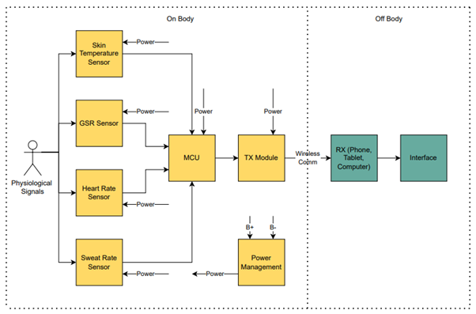{#fig:HighLevelDesign}

## Low-Level Design
### Sensor-MCU Pin Connections:
The pin connections of the sensors to the MCU were decided by ensuring the analogue components are connected to the ADC pins and that each component does not interfere with another. The final design settled upon as in Figure \ref{fig:MCUPinConnections}.

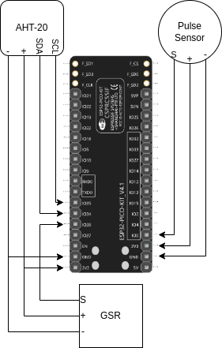{#fig:MCUPinConnections}

### Data Logging and Visualisation
When creating the data visualization application, the initial steps were designing early prototypes of the application interface using Figma. As shown on the left of  Figure \ref{fig:MobileApplication}, the interface will first require the user to connect to the internet via networks that are available near the wearable device. After successful connection, the sensors will begin outputting relevant health data, which will be updated live on the application through graphs and other forms of data analytics as shown on the right of  Figure \ref{fig:MobileApplication}. The graphs are displayed in a column format and the user should be able to access multiple sensor readings in the one page. Furthermore, the interface also includes a calendar icon as well as the menu icon on the header of the data visualization page. Ideally, the calendar icon is planned to allow the user to access health data records from previous time periods, and the menu item allows the user to navigate to other application functionalities.

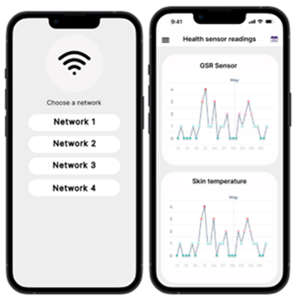{#fig:MobileApplication}

To build a prototype of a web-based application, different libraries were used, and certain hardware specifications were explored, as previewed in Figure \ref{fig:WebServerAndClient}. The ESP32 board includes a Serial Peripheral Interface Flash File System (SPIFFS), a lightweight file system designed for microcontrollers that contain a flash chip. The SPIFFS gives access to flash memory but is simpler and more limited relative to traditional filesystems. A few notable features include saving data permanently, saving HTML and CSS files and creating files to save relatively small amounts of data. The next component includes implementing the ESPAsyncWebServer library, which ultimately allows the data interchange between the microcontroller and other devices connected to the web. Furthermore, the library offers a quick template to build an asynchronous web server capable of handling multiple connections simultaneously. The outcome of the network architecture below involves the following: a request is sent to the ESP async server, which responds with the relevant files saved in SPIFFS. This loops for each data point reading, alternating between requests and responses.

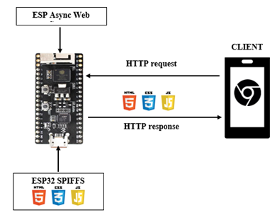{#fig:WebServerAndClient}

### Galvanic Skin Response Sensor
Based on the conclusion that there a large variation of GSR sensors is not available on the market, and those which are, are obtrusively designed, it was decided that a custom GSR sensor will be used to measure skin conductance. The general functionality of a GSR can be seen below in Figure \ref{fig:GSRFunctionality}, where electrodes are used as part of a voltage divider to measure skin resistivity. The output of the voltage divider is then input into a unity gain buffer to match input and output impedance. Subsequently, the signal is then filtered and amplified and passed to the MCU ADC.

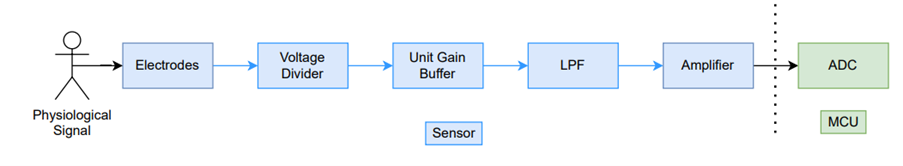{#fig:GSRFunctionality}

The Voltage Range of the ESP32 ADC is 0.2-2.4V, thus the output of the GSR sensor must be within this range. Therefore, supplying the sensor with 3.3V means that the output voltage must be divided by a certain factor to ensure compatibility with the MCU.

The voltage divider of the GSR sensor is used to translate the resistivity or conductance of the skin into an analogue measure of voltage so that the MCU can then convert the signal to a digital one. According to [@Webster2020], typical skin resistance ranges from 1k to 500k Ohm. Thus, a voltage divider can be designed to control the output.

The circuit design for the voltage divider can be seen in Figure \ref{fig:GSRVoltageDivider}, where Rs (the resistance of the skin) is added in parallel to R2:

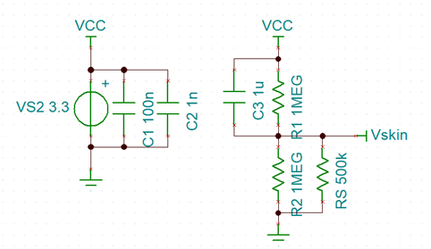{#fig:GSRVoltageDivider}

Subsequently, a voltage follower circuit is added to strengthen the signal and add high input impedance as seen in Figure \ref{fig:VoltageFollower}.

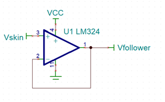{#fig:VoltageFollower}

[@Webster2020] states that Galvanic Skin Response typically oscillates within the 1Hz frequency, thus an LPF is used as seen in Figure \ref{fig:LPFAndAmp} to cut off the signal above 1Hz. Subsequently, the maximum voltage that can be achieved at the output of the LPF is 1.65V and occurs when RS is open circuited or has infinite resistance. Thus, the maximum gain of the circuit can be 1.455 V/V as anything higher would exceed the limitations of the ESP32 ADC Voltage Range.

{#fig:LPFAndAmp}

When RS is 35K (relatively low = high stress), the output voltage is 165.6mV as seen in Figure \ref{fig:HighStressTheoreticalVout}. When RS is 600K (relatively high = low stress), the output voltage is 1.33V as seen in \ref{fig:LowStressTheoreticalVout}.

Thus, in theory the circuit can be confirmed to be working.

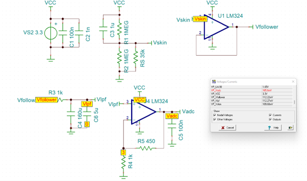{#fig:HighStressTheoreticalVout}

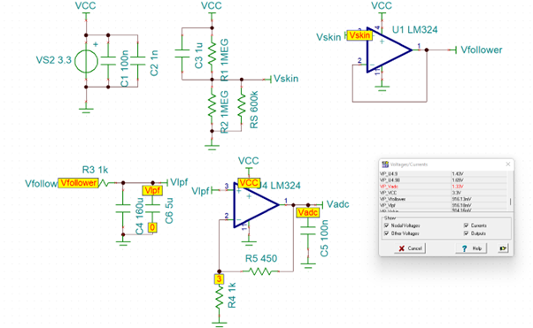{#fig:LowStressTheoreticalVout}

### Pulse Sensor
The Pulse Sensor is an analogue device which gives a value of the light the photodiode is receiving. There is a library for use with this device to calculate the heart rate and/or the Inter-Beat-Interval which is created by the same group as the device [@PulseSensor].

The waveform generated by the pulse sensor can be seen in Figure \ref{fig:PulseWaveform}, where the pulses outlined in red.

By setting a threshold for the analogue value read by the MCU, beats per minute can be derived.

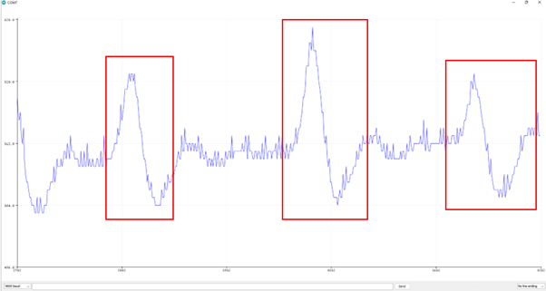{#fig:PulseWaveform}

{#fig:PulseAndBPM}

### Temperature Sensor
The Temperature Sensor is a digital sensor which communicates using I2C. There also exists a manufacturer’s library for this component by Adafruit [@Adafruit2022] Which makes the output of the graphs for temperature and humidity a trivial exercise in setting which pins are which and running the manufacturer provided sample code.

\label{fig:HumidityAndTemperature}

Figure \ref{fig:HumidityAndTemperature} illustrates the captured of waveform of humidity and temperature in red and blue respectively. The sensor utilises I2C functionality.

### Bluetooth Functionality
The chosen communication system between the device and a mobile phone is BLE as it requires relatively minimal energy to use. It has been tested and verified through the transmission of Skin Resistivity Data. See section on GSR Sensor Validation and Verification.

## Component Selection
1. Heart Rate Sensor: The major constraints decided upon for the heart rate sensor were the ability to be worn comfortably without impeding the sensor, the ability to communicate with common MCUs, and to be able to collect the heart rate data in real time. To this end we found seven different heart rate sensors from various suppliers and had to narrow them down further. The optimum sensor is the Spark Fun Pulse Sensor since it is very small and has flexibility of placement.
2. Galvanic Skin Response: We were unable to find a sensor which fit our requirements for cost and size, so we are going to be building our own GSR sensor as it is a relatively simple undertaking compared to the other sensors in our project. We will however be using a Grove GSR Sensor to calibrate our sensor and ensure it functions properly.
3. Skin Temperature: For measuring skin temperature the main constraints for the sensor were, temperature range, 3.3V operation, compact profile and I2C functionality. Thus the optimum sensor is the AHT20.
4. MCU: The MCU being the central component of the system must have certain requirements to be usable with this project. Namely, small form factor, I2C functionality, Sleep mode, Arduino compatible, low power consumption, Wi-Fi/Bluetooth compatibility. Thus, we have decided to use the ESP32 PICO D4 due to its extensive documentation, sleep mode, extremely small form-factor, Wi-Fi/Bluetooth functionality which can be processed in parallel with the rest of the operations on the chip. For development we will be using the ESP32-PICO-KIT Development Board due to its built-in programmer, Prototyping pins, and relatively small size.

For more information on component selection please refer to \ref{HeartRateSensorOptions} to \ref{MCUOptions}.

## Overall System Testing
With the eventual goal of detecting stress using physiological data, the overall wearable will be tested in a controlled stress-induced environment. Given the challenging nature of producing such an environment, there are a few options to induce stress in an experimental setting. A potential option is implementing virtual reality (VR) for standardized stress tests. With the introduction of low-cost virtual reality technologies such as the Oculus Rift or the HTC Vive, these VR sets demand user focus and simulate an immersive and interactive environment. The VR catalogue of games offers many choices regarding stress tests by incorporating emotion, social and physical demands. For example, certain height simulation games induce stress through the innate fear of the user being simulated at a high height scenario in conjunction with the physical demand of maintaining balance. Another possible way to simulate controlled stress environments is to use driving simulators. In our daily lives, unforeseen traffic situations can be the source of stress and other negative emotional states. Hence, another methodology to induce stress is to expose individuals to challenging and dynamic traffic conditions using VR. Thus, these examples described above pose as possible experimental stress inducers. Ideally, whilst being immersed in the VR game, the individual would be wearing our developed wearable device, and real-time data could be accessed and used for analysis and tested for accuracy. To validate the accuracy of the obtained health data, comparisons can be made against industry products that provide data on similar biomarkers.

# Background and Literature Review
## General Overview of Wearable Medical Devices
Wearable devices are typically defined as “fully functional, self-powered, self-contained computers that are worn on the body and provide access to data which can derive information to be analysed, anywhere and at any time” [@Barfield2015]. Examples of such devices which can measure multiple physiological parameters include a wearable bracelet was designed to continuously monitor bio signals including heart rate and body surface temperature [@Hu2020]. However, this project focussed primarily on the design of the overall system architecture and made little reference to implementation. Furthermore, it focussed heavily on the extension of machine learning to analyse biostatistical anomalies. Similarly, another project designed for event detection (falls, trips, jumps, etc), implanted into the fabric of firefighter protective equipment, included an efficient method for data transmission to a local base station but did not include the monitoring of health information [@Vanveerdeghem2014].

## IoT-Based Medical Devices
This section briefly outlines the relevant literature on IoT Based medical devices, which has shown potential for remote and long-term health monitoring, management, and analysis of clinical information (Webster, 2020). An IoT based medical system can loosely be defined as a sensor-based network of uniquely identifiable, addressable embedded systems connected via the internet (or other modes of communication) through standard communication protocols, capable of measuring physiological signals and providing access to information [@Atzori2010]. A simplified IoT Based medical device can be seen in Figure \ref{fig:SimplifiedIoT}.

Current examples of IoT Based medical devices include a digital respiratory health manage platform using sensors to monitor, record and transmit data for chronic obstructive respiratory diseases. An example of such a project is available Propeller Health [@Propeller].

![Simplified IoT Based Medical Device (Adapted from [@Webster2020])](Images/SimplifiedIotBasedMedicalDevice.png){#fig:SimplifiedIoT}

However, the use of standardised communication protocols, security concerns surrounding personal privacy can arise. Eavesdropping or packet sniffing where attackers can intercept and read private information could lead to loss of confidentiality [@Webster2020]. Furthermore, this could lead to life-threatening implications in devices such as insulin pumps, pacemakers, dialysis units [@Mosenia2017].

## Physiological Signals as Indicators of Stress
This section briefly reviews the literature surrounding the selected physiological signals and their relationship to stress. The human brain is part of the more general nervous system, which is divided between the central and peripheral nervous system (CNS and PNS) [@Christopoulos2019]. Of particular interest is the PNS which comprises the automatic functions of the entire nervous system and especially the sympathetic nervous system. Typically, changes in the sympathetic nervous system manifest as involuntary control of physiological signals such as heart rate, sweating, breathing and eye blinking [@Christopoulos2019].

Galvanic Skin Response (GSR), also called skin conductance (SC) or electrodermal activity (EDA), is a biomarker of the sympathetic nervous system and is considered one of the most sensitive and valid markers of emotional arousal [@Kyriakou2019]. GSR comprises two main components. The first is skin conductance level (SCL), which is the baseline without any emotional arousal and the second is skin conductance response (SCR) represents the body’s response to stimulus [@Wolfensberger1967] [@Nepal2016]. The main point of analysis of a GSR signal relies on the basis that there is a linear relationship between skin conductance and arousal [@Boucsein2012] and is represented in the amplitude of the measured signal [@Hegazy2011]. Subsequently, steeper gradients in the rise time of a measured GSR signal indicate more intense stimuli [@Caviedes2018] [@HernandoGallego2015]. A hypothetical measured GSR signal can be seen in Figure \ref{fig:HypotheticalSkinConductanceResponse}.

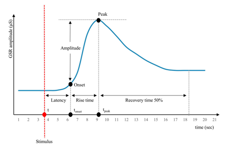{#fig:HypotheticalSkinConductanceResponse}

Skin temperature usually varies from 32 – 35 degrees Celsius [@Quazi2012], and has been shown to increase in response to stress [@Kaklauskas2011]. The skin responds to such hormonal milieu by regulating skin perfusion [@Bronzino2006].

The most promising signal for stress detection is heart rate variability (HRV) [@Malik1996] as it reflects the sympathetic and parasympathetic activities of the ANS measuring the temporal difference between successive heartbeats [@Kyriakou2019]. HRV is a common indicator of stress as it is considered very accurate regarding stress detection [@Karthikeyan2013] [@Alberdi2016] [@Sriramprakash2017].

## Photoplethysmography (PPG)
First discovered by Alrick Hertzman in 1937 [@Hertzman1937], PPG is linked to changes in blood volume of tissue. Its functionality relies heavily on Beer-Lambert’s law of light, where light absorption is directly proportional to the path length, concentration of substances, and the light absorption by each of those substances [@Aymen2014].

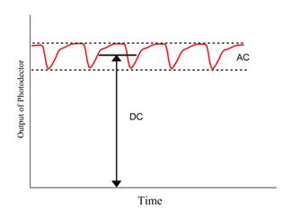{#fig:OutputOfPPG}

The output of a PPG sensor can be seen above where, “DC” refers to the unchanging background absorption of light and “AC” refers to the changing levels of absorption when blood volume in tissue changes (usually with each heartbeat) [@Aymen2014].

![Typical PPG Circuit (Adapted from: [@Webster2020])](Images/TypicalPPGCircuit.png){#fig:TypicalPPG}

[@Webster2020] illustrates a typical PPG circuit as seen in Figure \ref{fig:TypicalPPG}. Where T1 is a phototransistor.

PPG is an outstanding detector of cardiac arrhythmia [@Shelley2007] and is very sensitive, which allows it diagnose conditions which ECG cannot. Additionally, it is an accurate measure of heart rate variability (HRV).

## Skin Temperature (ST)
Temperature sensors are devices capable of measuring temperature using an electrical signal. There are essentially two groups of temperature sensors – non-contact and contact sensors. Non-contact sensors are capable of measuring temperature from a particular gap. More specifically, they can detect thermal radiation emitted from an object, and contact sensors, as the name suggests, can measure temperature through touch providing continuous monitoring and thermal data. In the marketplace, there are numerous hardware choices for temperature sensors. The first primary type of temperature sensor is the Resistance Temperature Detector (RTD). The RTD changes its resistance value as the temperature increases [@Arman2020]. This sensor displays a high degree of accuracy and precision; however, it fails when aspects such as material, protection and longevity are taken into consideration in the design process. The next type of sensor is the thermocouple, built using two metals joined together, and by processing heating and cooling at the intersection segment, a voltage is created that corresponds to a particular temperature measurement [@Abouellail2018]. The last type of temperature sensor is the thermistor, which varies its resistance value relative to temperature changes. Despite the similarities with the RTD, the thermistor differs in that it operates in a limited temperature range and generally has a slower response [@Arman2020].

Temperature sensors play an active role in providing real-time health data. With growing popularity in monitoring health data, current gaps include improvements in the sensors hardware structure to become more flexible, which encompasses thermistors, thermocouples, and thermochromic sensors [@Islam2020]. Important factors that determine the possibility of flexible temperature sensors include structure, material, fabrication, and performance. Regarding the design of wearable healthcare devices, the structure of the temperature sensor must be relatively compact and discrete as the physical dimensions play an important in the placement of the sensor into the case. The material aspect involves the medium used to build the structure of the device, ensuring maximal comfort to the user whilst maintaining a high degree of data measurement accuracy. The material component goes hand in hand with the fabrication process, which entails the processes required to create highly flexible material ensuring compatibility with other components. The final aspect and the most important one is performance. Ideally, the sensor should be capable of satisfying the above requirements whilst showing no performance drop-offs in an extraneous environment.

## User Interfacing and Application Development
Unprecedented advances in mobile technology have changed daily aspects of human lifestyle, pacifying technology to its parent and changing the way information is stored and accessed through mobile applications providing the user with a plethora of functionality. The first mobile app was the arcade game "Snake", built into the Nokia 6110[@########], and other typical applications soon followed, including ring tone editors, calculators and calendars. With the snake game quickly becoming a phenomenon, other early phone models followed, adding games such as Pong, Tetris and Tic-Tac-Toe. This changed the way individuals viewed communication, and with mobile prices also dropping and becoming more accessible for middle-class and low-income individuals, the number of people carrying these devices grew, as did the customer's demand for more features and games. However, manufacturers lacked the resources to build applications proportional to the user's demand, thus needing a portal for functional services independent from the mobile to develop applications. Jumping to the year 2007, the iPhone was announced, with Google soon after releasing the first android phone and Microsoft falling last releasing the windows phone in 2010. A common trait among these phones was their different application stores named App Store for Apple, Windows phone store for Microsoft and Google Play for Android. These stores allowed software developers to build apps and publish them in an application store, changing how users interact with mobile devices [@Li2021].

Although mobile devices started by not allowing the development of new programs, that soon changed, and the introduction of application stores accelerated the transition of third parties developing software. Notably, the two most popular proprietary mobile platforms were Apple's IOS and Google's Android, starting a platforms war with each having its own benefits and drawbacks. In general, mobile developers work with various programming environments, different tools and different programming languages. For the IOS apps, the two main programming languages are Swift and Objective-C [@Thomas2021]. Swift was personally designed by apple to replace Objective-C, and in comparison, swift has better speed, performance and memory handling features and is generally easier to read. Objective-C was the original IOS language and a child of the C language containing similar syntax and coding rules; however, Objective-C implemented robust object-oriented programming functionality. For android apps, two programming languages were recognized, both Java and Kotlin [@Devi2021], but also due to the open-source nature of the Android ecosystem, other languages such as C/C++ can be used. Java was popularized as the first object-oriented programming language for android app development, having a long history of stability and reliability starting from the early 2000s. Kotlin is an open-source programming language that serves as a viable alternative to Java and is noted to be a concise and clear language allowing shorter and easier-to-main code to be written.

There are native tools to build apps for multiple platforms at once; however, the tools used are limited to the lowest common denominator when building fully cross-platform apps. Despite the innovations made in application development, many developers came across a pitfall: developing apps that are compatible for both android and IOS devices without dedicating resources for each. This downfall ultimately accentuated the benefits of web-based applications where the user can access the application from any computer connected to the internet. Web-based applications allowed cross-platform compatibility with the minimum requirement of having a web browser [@Mwalongo2016]. Furthermore, web-based applications cost substantially less due to reduced requirements for maintenance and low demand on the end-user system, offering a more simplified architecture.

## Mental Stress Testing
This section will briefly outline the relevant work related to the methodology used to test for stress levels in subject. Healey and Picard [@Healey2005] recorded ECG, EMG and GSR while drivers followed a predefined route in the Boston area, to which they concluded that GSR and Heart Rate are closely correlated with drivers’ stress levels approaching an accuracy of 97%. De Santos Sierra tested GSR and Heart Rate in subjects which were asked to give a speech in front of a recording camera, to which they correlated with a questionnaire to calibrate and achieved 99% accuracy. In [@Cho2017], Virtual Reality (VR) environments were configured, and subjects were asked to perform mental arithmetic. The subjects were then asked to conduct a survey to evaluate the intensity of the stress. The research achieved an accuracy of 95%. In [@Zhang2016], la stroop test was employed and achieved 88.5% accuracy using GSR, ECG and EMG.

In [@Hassan2013], subjects were asked to play violent video games. During which, cardiac coherence was measured and posed that video gaming can induce stress to a surprising degree of accuracy. In [@Porter2019], subjects heart rate was monitored, and it was determined that video games can be positively correlated with stress.

Ultimately, the most accurate measures of mental stress are virtual reality environments or simulations both being calibrated with a digital or written journal.

## Powering Wearable Devices
Wearable devices in most cases are battery powered, some have supplemental energy sources to increase battery life or in some cases fully recharge the device.  Some energy conversion mechanisms include Electromagnetic-field-power-transmission, Photovoltaic energy harvesting, Thermoelectric energy harvesting, Chemical energy harvesting and Mechanical energy harvesting. All these energy generation methods when integrated into wearable devices generate much smaller energy [@Gao2021] than what we will be using with our ESP-32 and connected sensors so we will not be using them.

One of the most popular methods of powering wearable devices integrated into clothing is to sew a pocket to hold a small battery pack, often a commercial battery pack or LiPo Battery. There are some issues with this approach however, as LiPo batteries are noted for catching fire when overheated or punctured [@WearableTutorials].

## Gap Analysis
The main challenge when developing wearable devices is making them unobtrusive. That is, developing devices so that they do not intrude the regular bodily movement, including most prominently, the challenge of how to power such devices.

### Feasibility and Proof of Concept

For feasibility we ask four main questions (WikiFeasibility2021)

1. Is the project technically possible?
2. Can the project be afforded?
3. Is the project Legal & Ethical?
4. Can the project be done in time?

Of these, the answer to the first three was covered in the Project Proposal [@Us2022]. For the question of time, we have to this point come in at or before the time for each milestone, thus we expect to be able to complete this job on time.

To expedite the prototyping process, it has been decided that readily available componentry will be utilised. This is the case as rapidly establishing proof of concept before beginning to refine and increase the complexity of the project is typically accepted as the norm.

Ultimately, we were ablet to combine the sections into a complete, fully functional prototype. Where in which, the sensors communicate to an MCU, which is hosting a web server. This web server is then accessed via a web browser to view the data that is captured. Figure \ref{fig:SensorReadings} illustrates the utilisation of Google Chrome to view the captured waveforms of data.

\label{fig:SensorReadings}

# Preliminary Findings
## Overall Architecture
nitially the project considered the inclusion of an array of different sensors, however, primarily because of literature review, the three main physiological signals were chosen: galvanic skin response, skin temperature and pulse rate. It was found that these physiological signals correlate most heavily with stress and are require a reasonably low level of sophisticated techniques to acquire.

Due to the sophisticated nature of physiological signals, there are multiple suitable positions on the body that each of the signals can be acquired, thus testing and research is being conducted to determine the optimal location(s) for the placement of each sensor.

Fundamentally, the overall architecture of the design thus far has been quite appropriate, however, we are planning to account for the assumption that the wearable device will not always have internet connectivity. Thus, the current design of web server utilisation is not sufficient. Additionally, it was found that the pulse and galvanic skin response sensors are significantly sensitive to the pressure applied to them. Thus, more pressure applied yields a different data output.

## Galvanic Skin Response
To verify and validate the GSR Sensor, first the components of the circuit were soldered to a verification PCB board. The board includes a position for the MCU as can be seen in Figure \ref{fig:GSRSensorTop}. The contact points are shown in Figure \ref{fig:GSRSensorTop}, outlined in red. Whilst this prototype is somewhat chunky it provides the functionality required to verify the design.

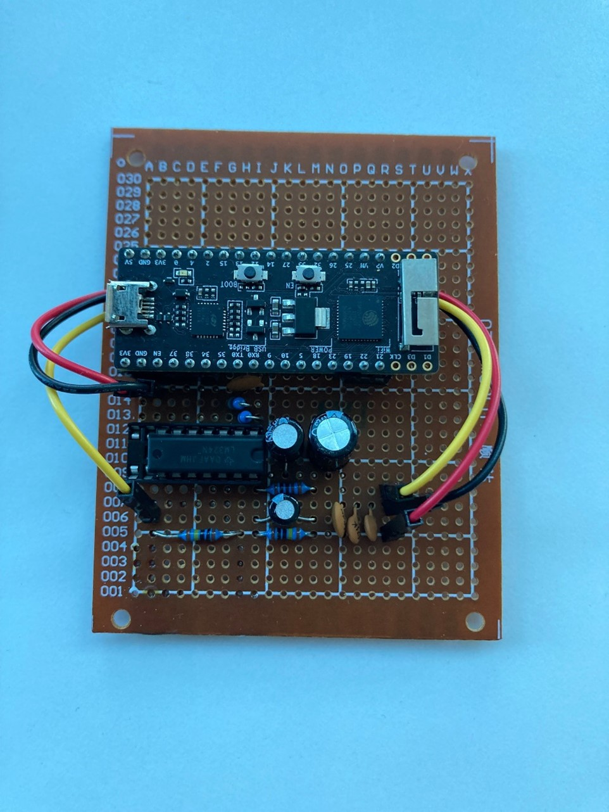{#fig:GSRSensorTop}

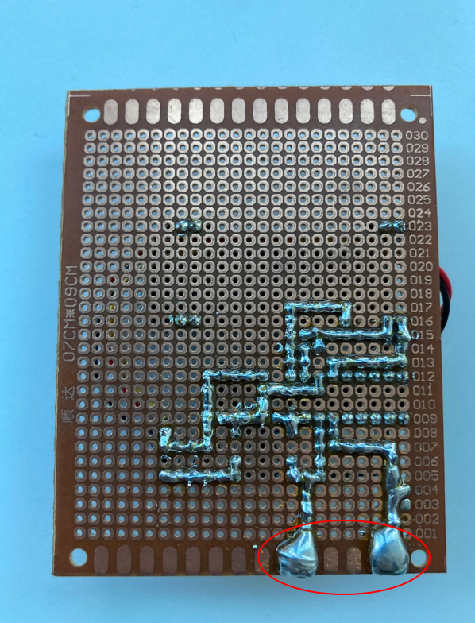{#fig:GSRSensorBottom}

As the voltage measured from the sensor is outputted via BLE, a BLE scanning app can be used to detect the changes in measurement. Figure \ref{fig:BLEScanning} shows the past five results received from the device and from this, the measured voltage level can be determined.

The used BLE scanner deciphers transmissions in HEX with swapped endianness which can then be converted to a floating-point number as a representation of the voltage measured by the sensor.

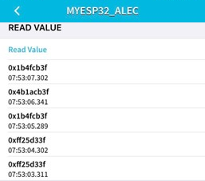{#fig:BLEScanning}

Using an online converter, the first reading `0x1b4fcb3f` can be converted and the result is as follows in Figure \ref{fig:HexConversionResult}. The output is 1.58V which corresponds to a relatively low skin conductance.

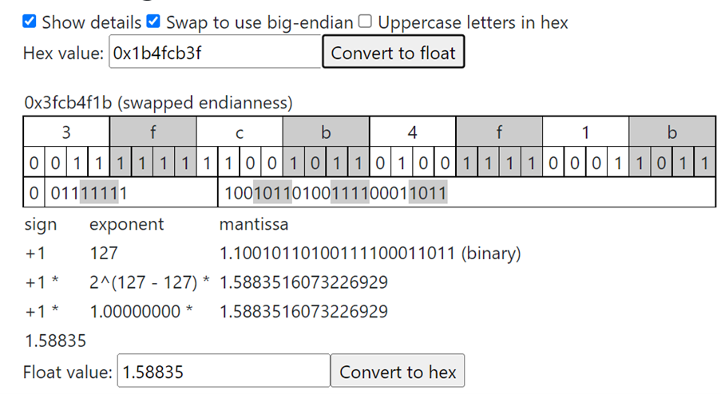{#fig:HexConversionResult}

Plans for testing the GSR sensor include:
1. Logging data over a period of multiple of multiple hours to gauge how it performs in response to flux in skin conductance.
2. Designing and developing a custom PCB which will require hardware verification and performance testing.
3. Collecting data from multiple locations on the body to determine which areas are most susceptible to flux in skin conductance.

The GSR has manifested as the result of two major design options. The first design included wired electrodes which would be stuck to two designated points on the body. This design ideology was discarded as it is virtually impossible to consistently place the electrodes at the same distance from each other without the help of sophisticated equipment. The second iteration of design is as visible in the engineering and methodology section, where the PCB consists of both the components and two solder contact points. This allows for a much more consistent skin resistance calculation.

Post choosing the second option, the functionality of the sensor evolved iteratively first with the inclusion of a unity gain buffer, second with the addition of a low pass filter and third with the addition of an amplification circuit.

Subsequently, the development of a prototyping PCB helped to conclude the functionality and validate the concept of the contact points on the PCB.

## Application and Data Visualisation
The first steps in creating a data visualization application included creating a prototype using MIT app inventor that would connect to an android device via Bluetooth. To test the application, a simple breadboard circuit was created with an ESP pin connected to a LED and resistor, and the goal of the app was to toggle a button to turn on/off the LED connected. Despite the success in creating a simple application, MIT app inventor was only compatible with android devices, isolating all IOS devices and alienating most of the group from accessing the app using their device. To address this problem, a switch was made, changing our focus to design a web-based application utilizing a web server to host our sensor data. This provided access to both android and IOS devices, ensuring compatibility of different mobile operating systems.

## Recommendations
The recommendations for future work, based on the findings from initial research and testing include:

1. Collecting data from all sensors over extended time periods to verify functionality
2. Utilise a web server to bypass (Bluetooth/mobile) communication complications in the early phases of the project.
3. Test the overall functionality of the project in controlled environments such as VR gaming.
4. Design custom PCB to compact design profile and minimise obtrusiveness.
5. Develop a user interface that displays the health data from the connected sensors.
6. Utilize VR as a potential way to test our developed wearable device.

Based on the findings additional recommendations are made:

1. A device should be constructed to maintain constant pressure applied to specifically the pulse and galvanic skin response sensors.
2. Portable chargers should be used to power the device.

## Critical Analysis
With the above-mentioned recommendations follows some important points to contemplate:

1. Should the contact points on the GSR sensor be made of lead-free solder?
2. How to best place components on the body?
3. Where to best place components on the body?
4. How to minimise the profile of the design?
5. What is the best way to store the user’s health data?
6. What analytics or information should be displayed regarding the health data obtained?
7. Are we able to access VR for testing purposes?
8. How reliable is VR to test our wearable device?

Additionally, when powering the device whether it be for testing or validation, portable chargers should be used. As in the case of a malfunction, connecting the MCU to a laptop which in turn is charging from an AC outlet may lead to serious injury or death as there is a direct line back to mains power. It is important to ensure that there is an isolation of power, thus portable chargers are recommended at this stage of the project. The intention however is to power the device by lithium battery.

# Project Management and Timeline
The original timeline for semester 1 can be seen in Appendix A. The difference is largely in the materials investigation section where, initially, a more generous amount of time was allocated. Whilst initially thought a fixed amount of time would suffice, in practice, a large effort was required initially but a more flexible testing regime was implemented ongoing. Additionally, significantly more time was allocated to prototype verification.

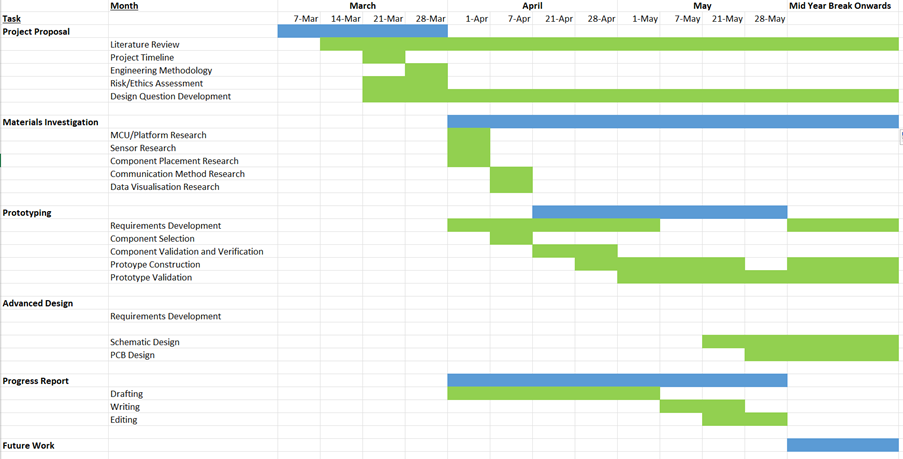{#fig:RefSem1Timeline}

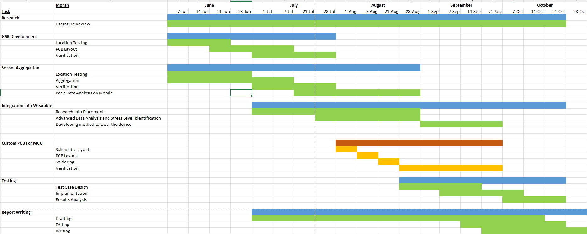{#fig:Sem2Timeline}

Figure \ref{fig:Sem2Timeline} represents the plan which is intended to be followed throughout semester 2. It is structured in a way which allows for redundancy to be built into each stage of the project. Of additional note, the task “custom PCB for MCU” is indicated in orange in red. This is because we have identified this task as something that will greatly improve the produced quality of the project but is not completely necessary to the functionality. We intend to follow this timeline to the best of our ability but recognise that alterations may be necessary.

## Management
Throughout semester one, the team has adopted an agile approach to engineering management, where in which, we would participate in both scheduled periodic meetings and non-scheduled meetings. Ad hoc meetings were called when issues arose that were immediate blockers to project progression. Scheduled meetings were used to interact and gain advice from our project supervisor. In both types of meetings, rigorous notes were taken to maintain record of who was responsible for what and when each task was completed.

# Conclusion
Wearable devices are becoming increasingly popular in providing the user with health-related data. Our wearable device intends to provide the user with information regarding their levels of stress. Currently, developments have been made on both the hardware and software portions of the wearable. For the hardware components, practical developments were made for the GSR sensor, and other hardware components were researched further for future prototyping and implementation.  For the software portion, early renders of the user interface were designed, and prototypes of the network software was created to ensure successful communication between a client device and the microcontroller. Our next step will involve prototyping other hardware components checking for compatibility and data accuracy, and progress in improving the current software is expected.

\newpage
# References
\printbibliography[heading=none]
\def\printbibliography{}

# Appendices

## Original Semester 1 Timeline

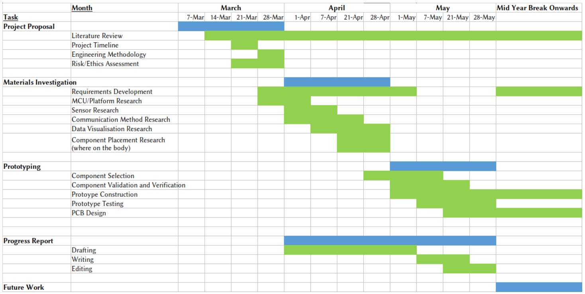{#fig:OriginalSem1Timeline}

## Heart Rate Sensor Options and Requirements \label{HeartRateSensorOptions}

| No | Requirement                                            | Reason                      |
|----|--------------------------------------------------------|-----------------------------|
| 1  | Must be able to sense heart rate in desired location   | To acquire signal           |
| 2  | Must be able to communicate with common MCUs           | To transmit signal          |
| 3  | Must be able to visualise heart rate data in real time | To obtain accurate readings |

| No | Sensor                              | Type | Location             | Operating Voltage | Price |
|----|-------------------------------------|------|----------------------|-------------------|-------|
| 1  | Heart rate educational starter pack | ECG  | Chest                | N/A               | 65    |
| 2  | Pulse Sensor Amped                  | PPG  | Fleshy extremity     | 3/5               | 25    |
| 3  | SEN023                              | PPG  | Anywhere on the skin | 3.3/6             | 26    |
| 4  | MAXREFDES117                        | PPG  | Anywhere on skin     | 2-5.5             | 51    |
| 5  | MAX30102                            | PPG  | Anywhere on skin     | 1.7-2             | 51    |
| 6  | Duinotech Heart Rate Sensor Kit     | ECG  | Chest                | 3.3               | 28    |
| 7  | MAX30101                            | PPG  | Anywhere             | 3.3               | 56    |

## GSR Sensor Options and Requirements \label{GSRSensorOptions}

| No | Requirement                                  | Reason                                   |
|----|----------------------------------------------|------------------------------------------|
| 1  | Must be placed in a non-obtrusive location   | Can't impede movement                    |
| 2  | Must be able to communicate with common MCUs | Facilitate communication between devices |

| No | Sensor             | Location | Operating Voltage |
|----|--------------------|----------|-------------------|
| 1  | Grove - GSR Sensor | Fingers  | 3.3/5             |

## Skin Temperature Sensor Options and Requirements \label{TempSensorOptions}

| No | Requirement                             | Reason                 |
|----|-----------------------------------------|------------------------|
| 1  | I2C Functionality                       | Compatibility with MCU |
| 2  | Compact Profile                         | Wearability            |
| 3  | 3.3V Operation                          | Power Consumption      |
| 4  | Temperature Range 20-45 Degrees Celcius | Body Temperature Range |

| No | Sensor   | RH Accuracy (%) | Temperature | Temp Accuracy | VCC     | I2C? | Price |
|----|----------|-----------------|-------------|---------------|---------|------|-------|
| 1  | Si7021   | -10-80          | -10-85      | +-0.4         | 3.3/5   | Yes  | 9.95  |
| 2  | AHT20    | 20-80           | 20-60       | +-2           | 3.3/5   | Yes  | 4.5   |
| 3  | HTS221   | 0-100           | -40-120     | 0.5           | 3.3/5   | Yes  | 9.95  |
| 4  | HDC1008  | 10-80           | -20-85      | 0.2           | 3/5     | Yes  | 7.5   |
| 5  | SHT15    | 0-100           | N/A         | 0.3 at 25 C   | ?       | Yes  | 41.95 |
| 6  | MCP9808  | N/A             | -40-125     | 0.25          | 2.7/5.5 | Yes  | 4.95  |
| 7  | ADT7410  | N/A             | -40-105     | 0.5           | 2.7/5.5 | Yes  | 5.95  |
| 8  | HTU21D-F | 5-95            | -30-90      | 1             | 3.3/5   | Yes  | 10.95 |

## MCU Options and Requirements \label{MCUOptions}

| No | Requirement           | Reason                              |
|----|-----------------------|-------------------------------------|
| 1  | Small Size            | Versatility for wearability         |
| 2  | I2C Functionality     | Ability to communicate with sensors |
| 3  | Sleep mode            | Low power consumption               |
| 4  | Arduino Compatible    | Consistent ability to program       |
| 5  | Low Power Consumption | Lessens battery requirement         |
| 6  | WiFi/Bluetooth        | Connection to central area          |

| No | Product  | Microcontroller | I/O Pins | Voltage | Arduino Compatible |
|----|----------|-----------------|----------|---------|--------------------|
| 1  | Si7021   | ATMega328P      | 6        | 2.7-5.5 | Yes                |
| 2  | AHT20    | ATMega2560      | 86       | 1.8-5.5 | Yes                |
| 3  | HTS221   | ATMega32U4      | 26       | 2.7-5.5 | Yes                |
| 4  | HDC1008  | SAMD21          | 20       | 1.6-3.6 | Yes                |
| 5  | SHT15    | ATTiny85        | 6        | 2.7-5.5 | Yes                |
| 6  | MCP9808  | ESP32           | 34       | 3.3     | Yes                |
| 7  | ADT7410  | ESP32           | 13       | 2.7-3.6 | Yes                |
| 8  | HTU21D-F | ATmega32u4      | 8        | 2.7-5.5 | Yes                |

## Data Visualisation Options

| No | Requirement                                                                                                                                        | Reason                                                                        |
|----|---------------------|---------------|
| 1  | Microcontroller IDE contains tools and libraries to visualize input data. E.g. Arduino Serial Plotter, Adafruit: Make Code and CircuitPython, etc. | Provides the user visual context of the information provided from the sensors |
| 2  | Receiving accurate and constant sensor data.                                                                                                       | Ensures the integrity of the data that is visualized.                         |

## Finalised List of Components
| Component          | Link                                                                  | Qty. |
| Temperature Sensor | https://core-electronics.com.au/qwiic-humidity-aht20.htm              | 3    |
| GSR Sensor         | https://www.digikey.com.au/short/n2hjtmtj                             | 1    |
| Heart Rate Sensor  | https://core-electronics.com.au/pulse-sensor.html                     | 3    |
| Microcontroller    | https://core-electronics.com.au/esp32-pico-kit-development-board.html | 3    |

## BLE Server Code \label{BLEServerCode}
```{c,eval=FALSE}
#include <BLEDevice.h>
#include <BLEUtils.h>
#include <BLEServer.h>
#define SERVICE_UUID        "4fafc201-1fb5-459e-8fcc-c5c9c331914b"
#define CHARACTERISTIC_UUID "beb5483e-36e1-4688-b7f5-ea07361b26a8"
int analogInput = 0;
float voltage = 0;
float vs = 3.3;
BLECharacteristic *pCharacteristic;

void setup() {
  BLEDevice::init("MYESP32_ALEC");
  BLEServer *pServer = BLEDevice::createServer();
  BLEService *pService = pServer->createService(SERVICE_UUID);
  pCharacteristic = pService->createCharacteristic(
    CHARACTERISTIC_UUID,
    BLECharacteristic::PROPERTY_READ |
    BLECharacteristic::PROPERTY_WRITE |
    BLECharacteristic::PROPERTY_NOTIFY
  );

  pCharacteristic->setValue("Hello");
  pService->start();
  // BLEAdvertising *pAdvertising = pServer->getAdvertising();  // this still is working for backward compatibility
  BLEAdvertising *pAdvertising = BLEDevice::getAdvertising();
  pAdvertising->addServiceUUID(SERVICE_UUID);
  pAdvertising->setScanResponse(true);
  pAdvertising->setMinPreferred(0x06);  // functions that help with iPhone connections issue
  pAdvertising->setMinPreferred(0x12);
  BLEDevice::startAdvertising();
}

void loop() {
  // put your main code here, to run repeatedly:
  analogInput = analogRead(38);
  voltage = analogInput * (vs/4095);
  pCharacteristic->setValue(voltage);
  pCharacteristic->notify();
  delay(2000);
}
```

## Web Server and Client Code \label{WebServerAndClient}
```{c,eval=FALSE}
#include <WiFi.h>
#include <ESPAsyncWebServer.h>
#include <string>
#include <SPIFFS.h>
#include <Wire.h>
#include <stdlib.h>

const char* ssid = "ENTER NETWORK NAME HERE";
const char* password = "ENTER NETWORK PASSWORD HERE";
AsyncWebServer server(80);

String sensorReading() { // return string of sensor information
  return String(random(100)); // placeholder value
}

String sensorReading2() { // return string of sensor information
  return String(random(100)); // placeholder value
}

String sensorReading3() { // return string of sensor information
  return String(random(100)); // placeholder value
}
void setup(){
  Serial.begin(9600);
  if(!SPIFFS.begin()){
    Serial.println("Make sure to sketch upload!");
    return;
  }

  // Connect to Wi-Fi
  WiFi.begin(ssid, password);
  while (WiFi.status() != WL_CONNECTED) {
    delay(1000);
    Serial.println("Connecting to WiFi...");
  }
  Serial.println(WiFi.localIP()); // This will print out the local ip address for the ESP32
  server.on("/", HTTP_GET, [](AsyncWebServerRequest *request){
    request->send(SPIFFS, "/index.html"); // Sends HTML file in SPIFFS when server receives a request on root URL
  });
  server.on("/sensor", HTTP_GET, [](AsyncWebServerRequest *request){
    request->send_P(200, "text/plain", sensorReading().c_str()); //Call sensor reading function when server receives a request on /sensor URL
  });
  server.on("/sensor2", HTTP_GET, [](AsyncWebServerRequest *request){
    request->send_P(200, "text/plain", sensorReading2().c_str()); //Call sensor2 reading function when server receives a request on /sensor2 URL
  });
  server.on("/sensor3", HTTP_GET, [](AsyncWebServerRequest *request){
    request->send_P(200, "text/plain", sensorReading3().c_str()); //Call sensor3 reading function when server receives a request on /sensor3 URL
  });
  // Start the server
  server.begin();
}
```

```
<!DOCTYPE HTML>
<html>
<head>
  <meta name="viewport" content="width=device-width, initial-scale=1">
  <script src="https://code.highcharts.com/highcharts.js"></script> <!-- Including highcharts js library -->
  <style>
    body {
      min-width: 310px;
      max-width: 800px;
      height: 400px;
      margin: 0 auto;


    }
    h2 {
      font-family: Arial;
      font-size: 2.5rem;
      text-align: center;
    }
  </style>
</head>

<body>
  <h2 class = "title">Sensor Readings</h2>
  <div id="sensor-one" class="container"></div>
  <div id="sensor-two" class="container"></div>
  <div id="sensor-three" class="container"></div>
</body>
<script>
var sensor1 = new Highcharts.Chart({
  chart:{ renderTo : 'sensor-one' },
  title: { text: 'Graph title 1' },
  series: [{
    showInLegend: false,
    data: []
  }],
  plotOptions: {
    line: { animation: false,
      dataLabels: { enabled: true }
    },
    series: { color: '#9e0505' }
  },
  xAxis: { type: 'datetime',
    dateTimeLabelFormats: { second: '%H:%M:%S' }
  },
  yAxis: {
    title: { text: 'y-axis' }
  },
  credits: { enabled: false }
});
setInterval(function ( ) { // The set interval function add new data points to the chart. Every 1 second it make a request to the /sensor URL to get sensor reading from ESP32
  var xhttp = new XMLHttpRequest();
  xhttp.onreadystatechange = function() {
    if (this.readyState == 4 && this.status == 200) {
      var x = (new Date()).getTime(),
          y = parseFloat(this.responseText);
      //console.log(this.responseText);
      if(sensor1.series[0].data.length > 40) {
        sensor1.series[0].addPoint([x, y], true, true, true);
      } else {
        sensor1.series[0].addPoint([x, y], true, false, true);
      }
    }
  };
  xhttp.open("GET", "/sensor", true);
  xhttp.send();
}, 1000 ) ;

var sensor2 = new Highcharts.Chart({
  chart:{ renderTo : 'sensor-two' },
  title: { text: 'Graph title 2' },
  series: [{
    showInLegend: false,
    data: []
  }],
  plotOptions: {
    line: { animation: false,
      dataLabels: { enabled: true }
    },
    series: { color: '#9e0505' }
  },
  xAxis: { type: 'datetime',
    dateTimeLabelFormats: { second: '%H:%M:%S' }
  },
  yAxis: {
    title: { text: 'y-axis' }
  },
  credits: { enabled: false }
});
setInterval(function ( ) {
  var xhttp = new XMLHttpRequest();
  xhttp.onreadystatechange = function() {
    if (this.readyState == 4 && this.status == 200) {
      var x = (new Date()).getTime(),
          y = parseFloat(this.responseText);
      //console.log(this.responseText);
      if(sensor2.series[0].data.length > 40) {
        sensor2.series[0].addPoint([x, y], true, true, true);
      } else {
        sensor2.series[0].addPoint([x, y], true, false, true);
      }
    }
  };
  xhttp.open("GET", "/sensor2", true);
  xhttp.send();
}, 1000 ) ;

var sensor3 = new Highcharts.Chart({
  chart:{ renderTo : 'sensor-three' },
  title: { text: 'Graph title 3' },
  series: [{
    showInLegend: false,
    data: []
  }],
  plotOptions: {
    line: { animation: false,
      dataLabels: { enabled: true }
    },
    series: { color: '#9e0505' }
  },
  xAxis: { type: 'datetime',
    dateTimeLabelFormats: { second: '%H:%M:%S' }
  },
  yAxis: {
    title: { text: 'y-axis' }
  },
  credits: { enabled: false }
});
setInterval(function ( ) {
  var xhttp = new XMLHttpRequest();
  xhttp.onreadystatechange = function() {
    if (this.readyState == 4 && this.status == 200) {
      var x = (new Date()).getTime(),
          y = parseFloat(this.responseText);
      //console.log(this.responseText);
      if(sensor3.series[0].data.length > 40) {
        sensor3.series[0].addPoint([x, y], true, true, true);
      } else {
        sensor3.series[0].addPoint([x, y], true, false, true);
      }
    }
  };
  xhttp.open("GET", "/sensor3", true);
  xhttp.send();
}, 1000 ) ;

</script>
</html>
```


## Group member contribution table \label{GroupMemberContributionTable}
| Section                                                          | Contributor(s)     | Person(s) responsible and percentage |
|------------------------------------------------------------------|--------------------|--------------------------------------|
| Executive Summary                                                | Ahad               | 100%                                 |
| Statement of Problem                                             | Alec               | 100%                                 |
| Design and Research Questions                                    | Alec, Ahad, Oliver | 50%, 20%, 30%                        |
| Overall System Architecture                                      | Alec               | 100%                                 |
| Low-Level Design: Sensor/MCU Pin Connections                     | Oliver             | 100%                                 |
| Low-Level Design: GSR                                            | Alec               | 100%                                 |
| Low-Level Design: Data Logging and Visualisation                 | Ahad               | 100%                                 |
| Pulse Sensor                                                     | Oliver             | 100%                                 |
| Temperature Sensor                                               | Oliver             | 100%                                 |
| Bluetooth Functionality                                          | Alec               | 100%                                 |
| Overall System Testing                                           | Ahad               | 100%                                 |
| Literature Review: General Overview of Wearable Medical Devices  | Alec               | 100%                                 |
| Literature Review: IoT Based Medical Devices                     | Alec               | 100%                                 |
| Literature Review: Physiological Signals as Indicators of Stress | Alec               | 100%                                 |
| Literature Review: Photoplethysmography (PPG)                    | Alec               | 100%                                 |
| Literature Review: Skin Temperature                              | Ahad               | 100%                                 |
| Literature Review: User Interfacing and Application Development  | Ahad               | 100%                                 |
| Literature Review: Mental Stress Testing                         | Alec               | 100%                                 |
| Literature Review: Powering Medical Devices                      | Oliver             | 100%                                 |
| Gap Analysis                                                     | Ahad, Alec, Oliver | 33%, 33%, 33%                        |
| Feasibility and Proof of Concept                                 | Alec, Ahad, Oliver | 33%, 33%, 33%                        |
| Preliminary Findings: Overall Architecture                       | Alec               | 100%                                 |
| Preliminary Findings: GSR                                        | Alec               | 100%                                 |
| Preliminary Findings: Application and Data Visualisation         | Ahad               | 100%                                 |
| Recommendations:                                			 | Alec, Ahad, Oliver | 33%, 33%, 33%                        |
| Critical Analysis:                              			 | Alec, Ahad, Oliver | 33%, 33%, 33%                        |
| Project Management and Timeline                                  | Alec               | 100%                                 |
| Conclusion                                                       | Ahad               | 100%                                 |
| Editing                                            			 | Alec, Ahad, Oliver | 33%, 33%, 33%                        |
