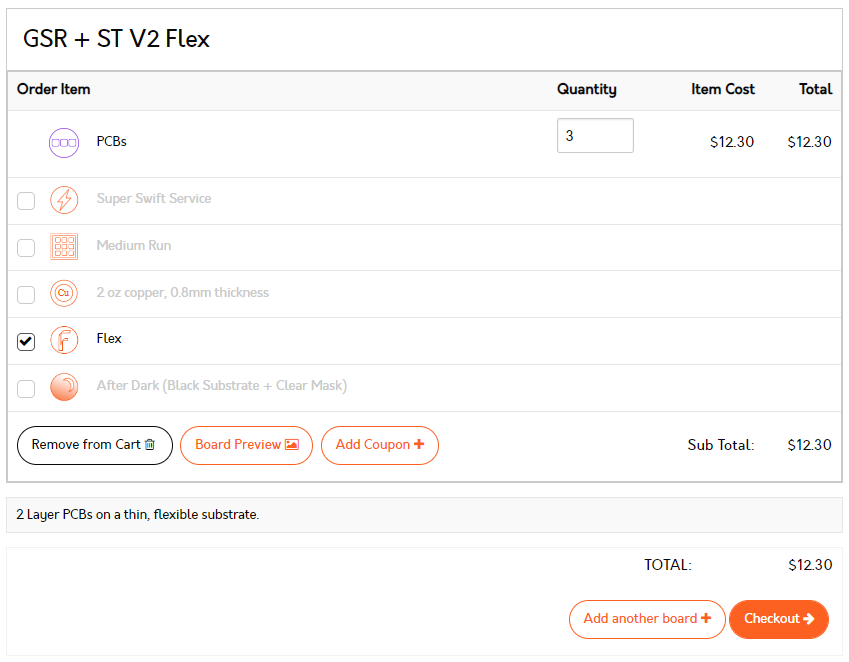
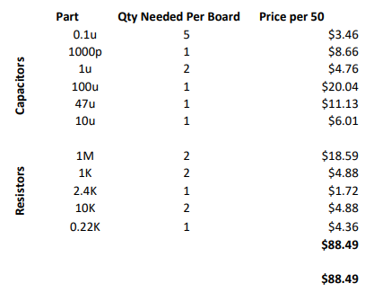

\pagestyle{empty}

\let\origfigure\figure
\let\endorigfigure\endfigure
\renewenvironment{figure}[1][2] {
    \expandafter\origfigure\expandafter[H]
} {
    \endorigfigure
}
\begin{centering}

\vspace{5 cm}

```{r,echo=FALSE}
knitr::opts_chunk$set(fig.align='center')
```

\Huge

{\bf Engineering Capstone Project \\ (OENG1168) \\ Completion Plan }

\vspace{1 cm}

Investigation of Materials to Develop a Wearable Stress Monitoring Device

\vspace{3 cm}

\Large

Oliver Patterson (S3723206),\\
Alec Harbis (S3661092),\\
Ahad Abdul (S3791936)

\vspace{3 cm}

\normalsize

\vspace{0.5 cm}

Supervisor: \\
Dr Katrina Neville

\vspace{0.5 cm}

Date: \\
07/08/2022

\vspace{3 cm}

\normalsize

RMIT School of \\
Engineering

\end{centering}
\newpage
\pagenumbering{roman}
\pagestyle{fancy}
\renewcommand{\headrulewidth}{1pt}
\renewcommand{\footrulewidth}{1pt}
\setlength{\headheight}{15pt}
\fancyhf{}
\fancyhead[L]{Completion Plan}
\fancyhead[R]{}
\fancyfoot[C]{\thepage}
\clearpage
\pagenumbering{roman}

# Executive Summary
The aim of this report is to develop a detailed plan with respect to the completion of the project. A general overview of completed tasks is provided and a brief explanation of the current stage which the project is at. The report then goes on to provide a list of tasks that need to be completed to achieve what the team set out in the Project Proposal. Overall, it will become clear the limitations the current device possesses, and the methods employ by which we hope to proceed towards a version which is appropriate for commercialisation. To visualise the expected trajectory of the project, a Gantt chart is provided with both a high-level overview and a more detailed breakdown of sub tasks. The project team aims to develop an unobtrusive version of the device with comprehensive functions which increase usability.

\newpage
\tableofcontents
\newpage
\pagenumbering{arabic}

# Introduction
With the growing popularity of IoT technologies and the continual development of computational power relative to size, wearable technology is expected to become an indispensable and integral part of our daily life. A valued adoption of wearable technology includes the use of wearables to enhance health monitoring more specifically stress monitoring. Stress is any physical, chemical or emotional factor that causes the human body to release hormones which consequently elicits other bodily responses such as increased muscle tension, higher pulse rate and generally increased alertness. Stress plays an important part in people's daily lifestyles having both short-term and long-term effects when not managed properly, thus this ultimately ushered in the opportunity to develop a wearable device that is capable of measuring stress whilst being integrated on the wearer's body. The current prototype of our device is capable of reading sensor data from our microcontroller and displaying the data on a mobile device, however further developments are still required to make our prototype fully functional. 

The main aim of this completion report is to provide an outline of the tasks required to complete the development of a wearable device that can capture data related to stress.  The tasks required range from research, design and engineering, and an extensive timeline has been established to ensure that milestones are met, and the development is on track to finish within the time period allocated. Furthermore, for the required tasks that need to be completed, a risk matrix has been created to evaluate any obstacles or pitfalls that the team may encounter for the duration of the project, and contingency plans have been created to prepare for the possibility of certain scenarios. 

# Completed Tasks
To date, the completed tasks in aggregation have successfully achieved the construction and testing of a prototype which demonstrated the ability to collect measurements of the three main physiological signals: galvanic skin response, skin temperature and pulse. The prototype was then able to display the data on a web server hosted on the microcontroller and accessed via web browser. Figure \ref{fig:PhysicalDevice} demonstrates the physical aspects of the device and Figure \ref{fig:WebBrowser} illustrates the web browser access portal.


\begin{figure}
\centering
\hfill
\begin{minipage}{.27\textwidth}
  \centering
  \includegraphics[width=\linewidth]{images/PhysicalDevice.jpg}
  \captionof{figure}{Physical Aspects of the Device}
  \label{fig:PhysicalDevice}
\end{minipage}%
\hfill
\begin{minipage}{.27\textwidth}
  \centering
  \includegraphics[width=\linewidth]{images/WebBrowser.png}
  \captionof{figure}{Web Portal}
  \label{fig:WebBrowser}
\end{minipage}
\hfill
\hfill
\end{figure}

## Tasks Completed
An itemised list of completed tasks categorised into both engineering and research is as follows.

### Engineering
1. Design of a circuit which can record and collect data from skin conductivity measurements.
2. Design of electrodes which press against the skin and facilitate the collection of data.
3. Testing associated with the design and implementation electrodes.
4. Testing of circuitry to collect and filter skin conductivity measurements.

### Research and Literature Review
1. Investigated options for sensors to collect physiological signals
2. Preliminary research into PPG, GSR, ECG, EEG Skin temperature.
3. Preliminary research into testing procedures.
4. Initial research into physiological signals and their correlation to stress.

## Current Limitations
Due to the nature of prototypes, the current state of the device is restricted in functionality by several limitations. Firstly, the device has no method of mounting to the body which restricts us from testing with respect to mobility. Secondly, the device is bulky which if it were mounted on the body in its current state, would render some natural movements of limbs uncomfortable or impossible. Thirdly, the web server is hosted on the microcontroller itself. Whilst this affords some benefits such as speed of development, it restricts both the amount data able to be held and the methods by data can be accessed.

\newpage
# Tasks to be Completed
The following itemised list of tasks to be completed aims to resolve some of the above listed limitations and develop the device into a more functional and ideally be of the standard which would enable commercial viability. The intention of each task is briefly outlined.

## Research
1. Review of mounting options (to body)\
	Research into the different potential locations for sensor placement given the literature on body mobility, sensor efficacy, sensitivity to locomotion, and other factors which could influence the placement of sensors on the body.
	1. Pulse Sensor: Ensuring the signal for the heartbeat is significantly above the level of noise and variability when moving
	2. GSR Sensor: Ensuring the signal for the GSR is consistent with the commercial sensor when active
	3. Temperature Sensor: Ensuring the reading from the temperature sensor is only influenced by skin temperature and external factors are negligible
2. Sensor placement locations
	- Research into the different methods of mounting PCBs (Flexi, Rigid-Flex and Rigid) will be conducted by looking through existing wearable devices, DIY projects, and commercially available attachment systems for suitable methods to mount the PCBs and other components to the human body in a way that does not interfere with data collection for the device.
3. Research of testing procedures
	- Research into different testing procedures used throughout literature to measure stress levels in order to determine the testing procedure for our system.
4. Methods to derive stress from collected data
	- Research through the existing literature to determine relationships between the physiological signals we are measuring and stress, as well as collecting the potential methods for categorising stressed and relaxed states used in literature to better inform testing procedures.
5. Research Battery and Charging Options
	- The intent of this task is to identify options which can both sufficiently power the device and simultaneously possess a small form factor to limit the impairment of mobility of the user.
6. Investigate power saving methods
	- The intent of this task is to identify methods by which power consumption can be kept to an absolute minimum. This may include sleep modes of the microcontroller and or special functions of sensors.
7. Investigate options for PCB material
	- The intention of this task is to investigate the possibilities of material construction type of the PCB which contains the GSR sensor and the Temperature Sensor. For example, flexible PCBs

## Engineering
1. Design and build mobile application
	1. Front-end Tasks
		1. Creating a Figma design for the user interface. This task involves using the popular browser-based interface design tool Figma, this will allow us to create a prototype of the user interface and will be used as a baseline when programming the front-end begins.
		2. Develop UI in HTML and JS. In this task, programming the front-end will begin mainly using HTML & JS to layout the interface and display the data obtained from the relevant sensors. A large amount is dedicated to this task to ensure that the user experience is smooth, and that the wearer of the device can access stress related information from their mobile device.
		3. Add display and user responsiveness. This task aims to cater for the wearers need in terms of the display size of their mobile device and involves creating a responsive interface regarding the user-journey. Although this task may be an additional feature, it is imperative for user inclusiveness and ensures the best user experience is created to inform the wearer of relevant biomarker data.
		4. Creating a Figma design for user interface. This task involves using the popular browser-based interface design tool Figma, this will allow us to create a prototype of the user interface and will be used as a baseline when programming the front-end begins.
	2. Back-end Tasks
		1. Setting up MySQL database. This task is one of the first back-end tasks and one of the most important tasks. This task will involve setting up the database schema and creating the best models to store our data in a specific format. Furthermore, relationships between different tables will be established.
		2. Developing PHP script. This task will involve programming the PHP script that is responsible for receiving incoming requests from the ESP32 microcontroller board and inserting that data into our MySQL database.
		3. Setup domain name and web hosting service. Both these tasks will involve signing up for a hosting service and picking a certain domain name. Ample amount of time is provided to complete this task, if setting up the hosting service is completed before projected time, transition into the front-end stage can start early.
2. Finalise Schematic for Galvanic Skin Response Sensor and Temperature Sensor
3. Design and build PCB for temperature and GSR sensors
	- The intent of this task to achieve the design of a custom PCB which possesses the ability to measure both GSR and skin temperature with an extremely small form factor as to limit the impairment of mobility.
4. Test PCBs
	- This task is to ensure that the fabricated PCBs perform the required functions and to eliminate any faults.
5. Testing of sensors for placement on body
	- This involves testing multiple locations around the body for the physiological responses received by all the sensors to better understand the available mounting positions to inform the mounting systems available for the device.

\newpage
## Testing
1. Determine what exactly is being measured in terms of stress
	- Creating a robust definition for stress which can be used to label a user as stressed in a way which can relate to physiological responses.
2. Determine a relationship between stress and physiological signals
	- Determining a method to categorise a user as stressed based on the physiological data collected by the device, as well as creating a calibration process for the method should the method be user specific.
3. Design testing procedure for the system
	- Designing a procedure to test the reliability, accuracy, comfort, and consistency of the system.

# Risks and Obstacles
This section is an exploration of the possible events which constrain the ability of the project team to complete the required tasks on time.

## Research
1. The risk that pre-existing literature does not exist that can facilitate or expedite the process by which the project team develops the device.
2. The risk that significant literature is found which alters the course of the project.
3. Appropriate options for powering the device cannot be identified in an appropriate timeline suitable to the success of the project.
4. An appropriate relationship cannot be determined or identified that links the various physiological signals that are being collected to causal level or value of stress.
5. The various options for PCB material are inappropriate to the application of the device for one reason or another and thus limit the possibility of achieving minimal obstructiveness.

## Engineering
1. The manufacture of PCBs by the manufacturer is delayed and thus renders it impossible to utilise a custom PCB in the final delivery of the project.
2. The purchase of components is delayed and extends beyond a reasonable timeline.
3. Faults exist in the custom PCB because of poor design or manufacture and render the manufactured PCBs useless.
4. Database schema relationship is incompatible with the applications need. This would make it difficult to interact with the database running the overall user experience.
5. Database models are not optimized for frequent queries. Based on the need for application, the user will be able to view real-time health data as well as previous time period data, this would ultimately mean that information from the database would be pulled continuously thus the database models have to be performant in high traffic scenarios.
6. Unable to configure the PHP script to communicate with microcontroller. Creating the PHP script serves as the middleman between the front-end and the back end however there may be technical obstacles regarding the streamlining the connection with the database.

## Design
1. An appropriate design of the GSR sensor custom PCB cannot be achieved the pre-determined timeline.
2. An appropriate design of the Skin Temperature sensor custom PCB cannot be achieved in the pre-determined timeline.
3. Appropriate locations cannot be determined for the various sensors.
4. Appropriate locations cannot be determined for the various components (MCU, Battery).
5. An appropriate physical proportioning of the custom PCB cannot be achieved and thus restrict the movement of the user.
6. User interface and layout doesn’t meet UX expectations. Although the primal focus of this project is to ensure that our device is wearable and capable of providing health data, we believe how we communicate and display that health data is an important component of this project.

## Testing
1. Stress cannot be defined in a manner that is able to be tested
2. A relationship between stress and the measured physiological signals cannot be reliably established
3. Testing of the device proves that the desired outcome has not been achieved, with respect to the initially laid out plans for the device

## Other
1. Communication within the project team breaks down and influences negatively upon the outcome of the project
2. Communication with the project supervisor or other important stakeholders breaks down

\newpage

## Risk Matrix

\begin{table}[ht]
\centering
\begin{tabular}{@{}|c|c|c|c|c|c|c|@{}} \hline
           & Rare                     & Unlikely                 & Possible                 & Likely                   & Near Certain             & Legend                                 \\ \hline
Negligible & \cellcolor[HTML]{0070C0} & \cellcolor[HTML]{0070C0} & \cellcolor[HTML]{0070C0} & \cellcolor[HTML]{00B050} & \cellcolor[HTML]{00B050} & \cellcolor[HTML]{0070C0}Low Risk       \\ \hline
Minor      & \cellcolor[HTML]{0070C0} & \cellcolor[HTML]{00B050} & \cellcolor[HTML]{00B050} & \cellcolor[HTML]{FFC000} & \cellcolor[HTML]{FF0000} & \cellcolor[HTML]{00B050}Medium Risk    \\ \hline
Moderate   & \cellcolor[HTML]{0070C0} & \cellcolor[HTML]{00B050} & \cellcolor[HTML]{FFC000} & \cellcolor[HTML]{FF0000} & \cellcolor[HTML]{FF0000} & \cellcolor[HTML]{FFC000}High Risk      \\ \hline
Major      & \cellcolor[HTML]{00B050} & \cellcolor[HTML]{FFC000} & \cellcolor[HTML]{FF0000} & \cellcolor[HTML]{FF0000} & \cellcolor[HTML]{C00000} & \cellcolor[HTML]{FF0000}Very High Risk \\ \hline
Extreme    & \cellcolor[HTML]{FFC000} & \cellcolor[HTML]{FF0000} & \cellcolor[HTML]{FF0000} & \cellcolor[HTML]{C00000} & \cellcolor[HTML]{C00000} & \cellcolor[HTML]{C00000}Extreme Risk   \\ \hline
\end{tabular}
\end{table}

\begin{table}[ht]
\centering
\begin{tabular}{@{}|c|c|c|c|c|@{}} \hline
\multicolumn{5}{|c|}{Risk Assessment for Completion Report}                                                                       \\ \hline
                               &                              & \multicolumn{3}{c|}{Risk Rating}                                  \\ \cline{3-5}
\multirow{-2}{*}{Section Name} & \multirow{-2}{*}{Risk Index} & Likelihood & Consequence & Rating                                 \\ \hline
                               & (1)                          & Unlikely   & Moderate    & \cellcolor[HTML]{00B050}Medium Risk    \\ \cline{2-5}
                               & (2)                          & Rare       & Major       & \cellcolor[HTML]{00B050}Medium Risk    \\ \cline{2-5}
                               & (3)                          & Unlikely   & Minor       & \cellcolor[HTML]{0070C0}Low Risk       \\ \cline{2-5}
                               & (4)                          & Rare       & Moderate    & \cellcolor[HTML]{0070C0}Low Risk       \\ \cline{2-5}
\multirow{-5}{*}{RESEARCH}     & (5)                          & Rare       & Minor       & \cellcolor[HTML]{0070C0}Low Risk       \\ \hline
                               & (1)                          & Likely     & Major       & \cellcolor[HTML]{FF0000}Very High Risk \\ \cline{2-5}
                               & (2)                          & Likely     & Major       & \cellcolor[HTML]{FF0000}Very High Risk \\ \cline{2-5}
                               & (3)                          & Possible   & Moderate    & \cellcolor[HTML]{FFC000}High Risk      \\ \cline{2-5}
                               & (4)                          & Possible   & Moderate    & \cellcolor[HTML]{FFC000}High Risk      \\ \cline{2-5}
                               & (5)                          & Possible   & Minor       & \cellcolor[HTML]{00B050}Medium Risk    \\ \cline{2-5}
\multirow{-6}{*}{ENGINEERING}  & (6)                          & Unlikely   & Moderate    & \cellcolor[HTML]{00B050}Medium Risk    \\ \hline
                               & (1)                          & Unlikely   & Moderate    & \cellcolor[HTML]{00B050}Medium Risk    \\ \cline{2-5}
                               & (2)                          & Unlikely   & Moderate    & \cellcolor[HTML]{00B050}Medium Risk    \\ \cline{2-5}
                               & (3)                          & Unlikely   & Moderate    & \cellcolor[HTML]{00B050}Medium Risk    \\ \cline{2-5}
                               & (4)                          & Possible   & Negligible  & \cellcolor[HTML]{016DBB}Low Risk       \\ \cline{2-5}
                               & (5)                          & Unlikely   & Minor       & \cellcolor[HTML]{016DBB}Low Risk       \\ \cline{2-5}
\multirow{-6}{*}{DESIGN}       & (6)                          & Unlikely   & Moderate    & \cellcolor[HTML]{00B050}Medium Risk    \\ \hline
                               & (1)                          & Unlikely   & Moderate    & \cellcolor[HTML]{00B050}Medium Risk    \\ \cline{2-5}
                               & (2)                          & Unlikely   & Major       & \cellcolor[HTML]{FFC000}High Risk      \\ \cline{2-5}
\multirow{-3}{*}{TESTING}      & (3)                          & Unlikely   & Extreme     & \cellcolor[HTML]{C00000}Extreme Risk   \\ \hline
                               & (1)                          & Unlikely   & Major       & \cellcolor[HTML]{00B050}Medium Risk    \\ \cline{2-5}
\multirow{-2}{*}{OTHER}        & (2)                          & Unlikely   & Major       & \cellcolor[HTML]{00B050}Medium Risk    \\ \hline
\end{tabular}
\end{table}

\newpage
# Mitigation Strategies to Ensure Completion
This section intends to pre-emptively identify possible solutions to the complications and obstacles identified above. It will likewise be categorised the same way as the previous section. The number of each mitigation strategy refers to the corresponding risk.

## Research
1. In the case that the pre-existing literature does not exist to support our claims or advise our future decisions, we will have to conduct the relevant testing to achieve our own understanding of the complication at hand.
2. If in the case that existing literature is found that alters the course of our project, the project team will conduct an evaluation of the current state of the project and significant components that could be reused in the continuation of the project down a new path.
3. If, in the case that an appropriate option cannot be found to appropriately power the device, an auxiliary power device could be used to demonstrate the feasibility and work that has been completed to date. The long-term powering of the device will be relegated to a section for future work.
4. If in the case that an appropriate relationship cannot be established through testing or by research that the collected data from physiological signals is found not to bear any significance to the feeling commonly connoted as “stress”, an appropriate new path or outcome for the project will be devised which utilise the fundamental components already developed. For example, a health monitoring device.
5. If in the case that, for example, flexible PCBs are not found to be appropriate for the application of, or obstruct regular movements of the common user, an appropriate solution will have to be found. This may include the use of conductive thread with stitched components onto fabric.

## Engineering
1. If in the case that the manufacture of PCBs by the manufacturer are delayed, the PCB design will be included as an item for future development and the project team will resort to the utilisation of Veroboard for the demonstration of the complete system.
2. If in the case that the purchase of the componentry is delayed beyond a reasonable time frame, in the same instance, alternative components will be utilised where the original cannot be reasonable acquired.
3. If faults exist within the manufacture of the PCB, and a reasonably expected amount of testing cannot determine the root cause, in the same instance verification PCB will be used to construct a method of demonstration.
4. To address the database relationship risk, risk a possible solution is to create a database schema mapping out models and parent/child relationships.
5. If models are not optimized for frequent queries, an alternative mitigation plan is to have trade-offs between user experience and performance.
6. If the PHP script can’t communicate with the microcontroller, the prototype network architecture can be used as a backup.

## Design
1. If in the case that an appropriate design of the custom GSR sensor cannot be achieved, an off the shelf GSR sensor will have to be utilised to emulate and augment the collection of data from the physiological signal.
2. If in the case that an appropriate design for the skin temperature sensor custom PCB, an off the shelf version will implemented, thus sacrificing mobility.
3. The best-fit locations we determined for testing will be used for each sensor
4. The additional components will be put into a small bag and carried with the user
5. If an appropriate sizing of the custom PCB cannot be identified, it will determine that mobility with respect to movement of the user will be sacrificed. Subsequently, the system may be demonstrated irrespective of human connection.
6. For the possible risk that the user interface and layout don’t meet the UX expectations, a possible strategy is to begin rapid prototyping starting from early stages of development.

## Testing
1. Stress will be first defined as a physical, mental, or emotional factor that causes bodily or mental tension and refined from there.
2. We will begin by using processes found in literature to categorise the physiological signals into stressed and relaxed and refine the processes from there
3. See all above strategies

## Other
1. Ensure that we have regularly scheduled meetings with both the project and supervisors. With set tasks to complete and achievable milestones.

# Expected Project Finances
| Item                 | Projected Cost |
|----------------------|----------------|
| PCB Manufacturing    | 100            |
| PCB Components       | 90             |
| Textile Components   | 50             |
| E-Textile Components | 25             |

\newpage
\blandscape
# Timeline
\scalebox{0.47}{
\begin{gantt}[xunitlength=0.5cm,fontsize=\small,titlefontsize=\small,drawledgerline=true]{39}{92}
	\begin{ganttitle}
		\titleelement{July}{14}
		\titleelement{August}{31}
		\titleelement{September}{30}
		\titleelement{October}{17}
	\end{ganttitle}
	\begin{ganttitle}
		\numtitle{18}{1}{31}{1}
		\numtitle{1}{1}{31}{1}
		\numtitle{1}{1}{30}{1}
		\numtitle{1}{1}{17}{1}
	\end{ganttitle}
	\ganttbar			{ Analysis of Mounting Options     }{ 00 }{ 11 }
	\ganttbar			{ Component Placement Selection    }{ 00 }{ 11 }
	\ganttbarcon		{ Power System Research            }{ 15 }{ 31 }
	\ganttbarcon		{ Power System Purchasing          }{ 46 }{ 07 }
	\ganttbarcon		{ Power System Mounting            }{ 53 }{ 24 }
	\ganttmilestonecon	{ Power System Complete            }{ 77 }
	\ganttbar			{ GSR Schematic Layout             }{ 00 }{ 05 }
	\ganttbar			{ ST Schematic Layout              }{ 00 }{ 05 }
	\ganttbar			{ PCB Shape Design                 }{ 05 }{ 05 }
	\ganttbar			{ Review of Schematics             }{ 05 }{ 05 }
	\ganttbarcon		{ PCB Trace Layout                 }{ 10 }{ 05 }
	\ganttmilestonecon	{ PCB Sent to Manufacturer         }{ 15 }
	\ganttbarcon		{ Manufacture PCB                  }{ 15 }{ 31 }
	\ganttmilestonecon	{ PCB Recieved from Manufacturer   }{ 46 }
	\ganttbarcon		{ Solder componentry to PCB        }{ 46 }{ 14 }
	\ganttbarcon		{ Test PCB                         }{ 60 }{ 17 }
	\ganttbar			{ Implement PCB as wearable device }{ 60 }{ 17 }
	\ganttmilestonecon	{ PCB Verified                     }{ 77 }
	\ganttbar			{ Setting up MySQL database        }{ 00 }{ 08 }
	\ganttbarcon		{ Develop PHP script               }{ 08 }{ 10 }
	\ganttbarcon		{ Setup domain name                }{ 18 }{ 14 }
	\ganttbar			{ Setup web hosting service        }{ 22 }{ 10 }
	\ganttbarcon		{ Create Figma for UI              }{ 32 }{ 03 }
	\ganttbarcon		{ Develop UI in HTML \& JS         }{ 35 }{ 42 }
	\ganttbar			{ Add CSS styling                  }{ 40 }{ 37 }
	\ganttbar			{ Add display responsiveness       }{ 47 }{ 30 }
	\ganttmilestonecon	{ App Completion                   }{ 77 }
	\ganttbar			{ Initial Testing Procedure Design }{ 00 }{ 32 }
	\ganttbarcon		{ Conduct Testing Procedure        }{ 32 }{ 45 }
	\ganttbar			{ Testing Procedure Refinement     }{ 32 }{ 45 }
	\ganttmilestonecon	{ Testing Complete                 }{ 77 }
	\ganttbar			{ Completion Plan Writing          }{ 00 }{ 21 }
	\ganttmilestonecon	{ Completion Plan Submitted        }{ 21 }
	\ganttbar			{ Final Report Writing             }{ 21 }{ 69 }
	\ganttmilestonecon	{ Final Report Submission          }{ 90 }
	\ganttbar			{ Presentation Writing             }{ 78 }{ 12 }
	\ganttmilestonecon	{ Presentation Done                }{ 92 }
	\ganttcon			{ 5}{ 8}{ 5}{10}
	\ganttcon			{ 5}{ 8}{ 5}{11}
	\ganttcon			{ 5}{ 9}{ 5}{10}
	\ganttcon			{ 5}{ 9}{ 5}{11}
	\ganttcon			{10}{10}{10}{12}
	\ganttcon			{11}{ 2}{15}{ 4}
	\ganttcon			{18}{21}{22}{23}
	\ganttcon			{32}{22}{32}{24}
	\ganttcon			{32}{29}{32}{31}
	\ganttcon			{35}{24}{40}{26}
	\ganttcon			{35}{24}{47}{27}
	\ganttcon			{60}{16}{60}{18}
	\ganttcon			{77}{17}{77}{19}
	\ganttcon			{77}{25}{77}{28}
	\ganttcon			{77}{26}{77}{28}
	\ganttcon			{77}{30}{77}{32}
\end{gantt}
}
\elandscape


\newpage
# Appendix
## Contribution Table
| Section                   | Contributor(s)     | Percentage Responsibility |
|---------------------------|--------------------|---------------------------|
| Executive Summary         | Ahad               | 100%                      |
| Introduction              | Ahad               | 100%                      |
| Completed Tasks           | Alec               | 100%                      |
| Tasks to be Completed     | Ahad, Alec, Oliver | 33%, 33%, 33%             |
| Risks and Obstacles       | Ahad, Alec, Oliver | 33%, 33%, 33%             |
| Mitigation Strategies     | Ahad, Alec, Oliver | 33%, 33%, 33%             |
| Risk Table                | Ahad               | 100%                      |
| Timeline                  | Ahad, Alec, Oliver | 30%, 30%, 40%             |
| Editing                   | Ahad, Alec, Oliver | 30%, 30%, 40%             |
| Formatting                | Oliver             | 100%                      |
| Expected Project Finances | Alec               | 100%                      |

## PCB Quote


## PCB Component List

