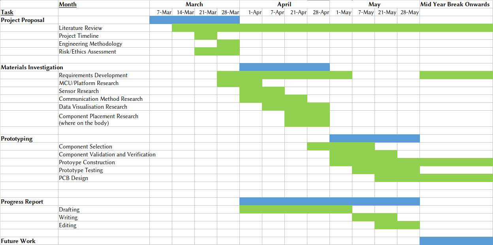

\pagestyle{empty}

\let\origfigure\figure
\let\endorigfigure\endfigure
\renewenvironment{figure}[1][2] {
    \expandafter\origfigure\expandafter[H]
} {
    \endorigfigure
}
\begin{centering}

\vspace{5 cm}

\Huge

{\bf Engineering Capstone Project \\ (OENG1167) \\ Investigation of Materials to Develop a Wearable Stress Monitoring Device}

\vspace{4 cm}

\Large

Oliver Patterson (S3723206),\\
Alec Harbis (S3661092),\\
Ahad Abdul (S3791936)

\vspace{4 cm}

\normalsize

\vspace{0.5 cm}

Supervisor: \\
Dr Katrina Neville

\vspace{0.5 cm}

Date: \\
03/04/2022

\vspace{4 cm}

\normalsize

RMIT School of \\
Engineering

\end{centering}
\newpage
\tableofcontents
\newpage
\pagenumbering{roman}
\pagestyle{fancy}
\renewcommand{\headrulewidth}{1pt}
\renewcommand{\footrulewidth}{1pt}
\setlength{\headheight}{15pt}
\fancyhf{}
\fancyhead[L]{Investigation of Materials to Develop a Wearable Stress Monitoring Device}
\fancyhead[R]{}
\fancyfoot[C]{\thepage}
\clearpage
\pagenumbering{arabic}

# Executive Summary
With the advent of IoT technologies and the continual growth of computational power relative to size, wearable technology can capture real-time data providing the user with insightful information whilst being embedded on textile fabrics, adhesively attached somewhere, or implanted on the wearer’s body.  The main aim of this paper is to provide an outline on the development of a wearable device that can capture data related to stress. In addition, an investigation will take place into the materials required to develop such a device with the hope of maximizing user comfort.

This proposal hopes to shed light on the components required to construct our wearable, undergoing extensive research on the constituent parts required for the device whilst taking into consideration certain characteristics such as component size, data precision, and compatibility, all of which play an integral part in the success and execution of the final product.  Furthermore, a timeline is established providing a plan for the design and development of our wearable from the proposal phase to the final prototype.

The end goal of this project is to develop a practical prototype of a wearable device that can provide the user with real-time health data. What we hope to achieve with our prototype is a device for monitoring the biomarkers indicative of stress.

\newpage
# Introduction
Stress is an ordinary physical response to everyday circumstances and challenges. Stress is comprised of both mental and physical components and when it arises, the human body automatically releases adrenaline and other hormones as a natural response. Stress can be quite useful when under control as it allows humans to be productive and efficient. However, stress, left unchecked, can quickly spiral into unproductivity or anxiety.

Studies indicate that devices which monitor Heart Rate Variability (HRV), Electrodermal Activity (EDA) and Body Temperature may be useful in the analysis of stress levels. HRV (a measurement of heart rhythm over time), EDA (a measurement of the changes in skin conductance) and Body Temperature provide insights into the Autonomic Nervous System (ANS). The ANS is responsible for the sending of signals to the body which either stimulate or relax different involuntary processes (such as heart rate, sweat secretion and body temperature) [@Chung2021].

The consequences of untreated stress are vast and have a ripple effect across a person's physical and mental health. Aligned with the growing use of telehealth and telemedicine for stress management, wearable technology that both monitors the physiological indicators of stress and provides feedback to the user are becoming more widely accepted.

The advent of miniaturised electronic circuitry and wearable conductive materials in combination with widely used mobile computing devices and wireless communication have enabled the unobtrusive continuous measurement of physiological signals. This has subsequently allowed the advent of real-time coaching, pre-emptive management in mission critical applications, or real-time data updates to physicians during episodes of chronic health conditions. Furthermore, these technological advancements can now be applied to devices and applications which monitor the ANS.

There are, however, still significant challenges in the analysis of stress through wearable devices such as: wearability, accuracy, and battery-life.

This document outlines the information in relation to what this project will involve:

1. The investigation of materials and methods for the development of wearable technology
2. The development of a wearable device to measure physiological signals with respect to the ANS.

More specifically, this document will elaborate on:

1. The current literature related to ANS monitoring devices and the technology involved
2. A detailed list of design and research questions
3. Methodology in relation to time and resource budgeting
4. The associated risks and ethical considerations

\newpage
# Statement of Problem
Identifying and understanding periods of elevated stress could significantly increase our understanding of how stress relates to productivity and long-term health. Thus, having a wearable device that can monitor key physiological signals associated with the Autonomic Nervous System could provide key insights into the levels and effects of stress. This project will aim to investigate the materials and methods of construction for wearable devices and then verify these findings through the development of a stress monitoring wearable device. This project will require knowledge of core electronic principles including microcontrollers and sensors, as well as basic textile skills. Project success will be determined by mainly the wearability of the device and accuracy of the data.

# Background and literature review

## General Overview of Wearable Technology
Wearable devices can be defined as “fully functional, self-powered, self-contained computers that are worn on the body and provide access to data which can derive information to be analysed, anywhere and at any time” [@Barfield2015]. These kinds of smart wearable devices are readily available today in many forms. These forms include a wide range of devices such as wristbands and watches, smart glasses, earpieces, and jewelery such as rings and necklases [@Rani2021]. These devices can largely be divided into two main groups depending on where they are placed on the body. The first being head mounted displays such as the smart glasses, the second being body mounted sensors such as wristbands. Similarly, there is an increasing amount of research into the applications of smart fabrics, which can communicate with external devices so they can process biometric information such as heart rate, temperature, and stress [@Fernandez2018]. Examples of such devices which can measure multiple physiological parameters include a wearable bracelet was designed to continuously monitor bio signals including heart rate and body surface temperature [@Hu2020]. However, this project focussed primarily on the design of the overall system architecture and made little reference to implementation. Furthermore, it focussed heavily on the extension of machine learning to analyse biostatistical anomalies. Similarly, another project designed for event detection (falls, trips, jumps, etc), implanted into the fabric of firefighter protective equipment, included an efficient method for data transmission to a local base station but did not include the monitoring of health information [@Vanveerdeghem2014]. The main challenge when developing wearable devices is making them unobtrusive. That is, developing devices so that they do not intrude the regular bodily movement, including most prominently, the challenge of how to power such devices.

\newpage
## Overview of Stress Detection and Wearable Devices
High levels of stress have become a serious problem in modern society and can lead to illnesses such as cognitive dysfunction, depression and even cardiovascular disease [@Crowley2011] [@Kofman2006]. As such, there has been a significant up-trend in the interest surrounding prevention-oriented stress management. There is a plethora of methods for stress detection which utilise multi-modal physiological signal analysis. Typically, these methods involve the measurement of heart rate variability (HRV) through electrocardiograms (ECG), electroencephalograms (EEG) and Galvanic Skin Response (GSR). In [@Kyriakou2019], the prime focus was the detection of moments of stress in real world conditions as opposed to ideal-laboratory conditions. The project utilised mainly Galvanic Skin Response sensors to detect an increase in Electrodermal Activity and then correlated this data with GPS coordinates. In [@Sano2018], the researchers developed an Android application to correlate incoming phone calls and text messages (without logging the data) with self-reported moments of stress, skin conductance measurements and heart rate variability. They achieved roughly 80% success rate in the detection of stress compared to the self-reported levels. [@Choi2018] proposed a wrist worn wearable device for the measurement of stress, fatigue, and drowsiness during driving. It monitored mainly Galvanic Skin Response and Skin Temperature without ECG. 

![Adapted from [@Choi2018] ](Images/Example_Wearable_System.png){width=80%}

\newpage
## Data Acquisition

### ECG Monitoring
An Electrocardiogram system is a sophisticated device for patient vital heart monitoring and supervision. It is mainly used as a diagnostic tool to measure the electrical signals that control various activities of the heart [@Ramasamy2018]. ECG monitoring is widely being used in wearable devices for applications such as emotion recognition [@Claisse2017], ambulatory cardiac monitoring [@Steinberg2019] and heartbeat arrythmia detection [@Sadrawi2017]. Typically, ECG sensors are used to measure heart rate variability (HRV), that is the variance in time between heart beats. This is usually what governs the application of the ECG sensor. The materials and methods used in the fabrication of a wearable ECG sensor are an important factor determining the comfort level offered by the sensor [@Ramasamy2018]. The most common method of comfortable electrode fabrication involves combining metal electrodes onto a polymer substrate. Apart from the electrodes, the signal conditioning elements that follow are impervious to the system. They allow for any form of analysis to follow. In [@Agung2017], a wireless application of a readily available ECG sensor is deployed. The project utilises a common microcontroller to serialise the data and subsequently visualise the information on a PC. This, however, is limited as the commonly available sensor requires the attachment of electrodes to the chest, thus limiting movement away from the device. Furthermore, in [@Ahmed2020] an application of a low power, optical heart rate monitor is used to measure heart rate and rhythm in real time. This project is limited however, by the communication method used to record data as it employs closed circuit television to view LEDs strapped to the wearer’s wrist. This is inevitably bulky and restricts movement out of view of the camera. 

![Complete ECG with Signal Conditioning Elements [@Ramasamy2018] ](Images/CompleteECG.png){width=50%}

![Adapted from [@Ahmed2020] ](Images/AdaptedFrom.png){width=50%}

\newpage
### Temperature
Temperature sensors are devices that measure temperature through the output of an electrical signal. They are used across multiple domains ranging from industrial applications, home applications, medical applications, and lastly scientific applications [@Liu2021] to name a few. Essentially, there are two categories of temperature sensors, non-contact, and contact sensors. Non-contact sensors can determine temperatures from a certain distance, specifically measuring the thermal radiation that a given object emits. Products or equipment that fall under the non-contact category includes thermal imaging products, handheld infrared thermometers, and fiber optic temperature sensors [@Mnati2021]. Common applications of non-contact temperature sensors include implementations within motor vehicles to measure the temperature of components such as the radiator, refrigerators/freezers use non-contact sensors to regulate and stabilize the cool temperature internally, and lastly, integrated circuits rely on temperature sensors in micro-controllers and other electronic components. The other category of temperature sensors are contact temperature sensors which measures temperature through touch providing constant monitoring and thermal data. Some common types of contact temperature sensors include thermocouples, thermistors, thermostats, and semiconductor temperature sensors.

There are a plethora of temperature sensors each with its own advantages and disadvantages. The first main type of temperature sensor is the Resistance Temperature Detector (RTD). The RTD manipulates it's own resistance value as the temperature increases. This sensor exhibits a high degree of accuracy and consistency making them preferable over thermocouples, in addition this sensor can be formed with a relatively low thickness making it a suitable candidate for a wearable device [@Kuzubasoglu2020]. However, where this sensor fails is when aspects such as material, protection and longevity are taken into consideration in the design process. The next type of temperature sensor is the thermocouple, utilizing two metals joined together and through heating/cooling the intersection a voltage is created which is then correlated back to a temperature value [@abouellail2018]. Due to the size and structure of thermocouples the thickness is too large for integration into a wearable device, hence not being able to provide comfort to the user and unable to provide accurate readings in a changing environment. The last main type of temperature sensors is the thermistor, designed using materials that varies in resistance upon temperature change, relative to the RTD, the thermistor contains a limited temperature range and slow response however it is inexpensive and durable[@Kuzubasoglu2020], thus it is potentially another viable candidate to be used in wearables.

Temperature sensors play a key role in effective skin temperature measurement providing real-time continuous health data. With growing interest in wearable healthcare devices, recent developments include flexible temperature sensors such as flexible thermocouples, flexible thermistors, and flexible thermochromic sensors[@zhang2019], thus, transitioning from rigid equipment and lessening the measurement uncertainty  that stems from the motion of the wearer. Important factors that decide the viability of flexible temperature sensors include structure, material, fabrication, and performance. Structure encompasses the device’s physical dimensions in a ideal scenario a device that is relatively compact and discrete would make the perfect candidate. Material comprises of the medium used to build the structure of the device using flexible materials to both hold and create the temperature sensor that ensures maximal comfort to the user. In conjunction, fabrication is relevant to the process involved in achieving high flexibility material whilst maintaining its functional integrity. The final attribute and arguably the most important is performance, ideally the sensor should be capable of meeting the previous attribute criteria whilst displaying no performance deterioration in fast-changing environments.

### Galvanic Skin Response
Relaxation is an important measure of physical and mental wellbeing. To be able to quantify levels of relaxation and possibly the inverse of relaxation, stress, is becoming more common in wearable devices. Currently the methods for doing so incorporate the measurement of physiological signals such as electrodermal activity. Typically, when under emotional stress skin will fluctuate in the level of conductivity [@Martinez2019]. This is called Galvanic Skin Response, Electrodermal Activity or Skin Conductance.  

A project which detailed the development of a GSR sensing sock [@Healey2011] utilised fabric electrodes to continuously monitor skin conductance throughout the day. The approach to measure GSR via unobtrusive sock evidently presents a potential solution to non-invasive goals. 

![Sensing GSR on the fingertips [@Hong2012] ](Images/GSR_Principle.png)

GSR is typically measured on the fingertips as described in [@Hong2012]. This provides an effective and easy to measure location however, this may not be considered a method to continuously monitor GSR as electrodes may be obtrusive to regular bodily movement. 

In [@villarejo2012], the researchers have the objective of measuring Galvanic Skin Response using a simple voltage divider with Band Pass Filter. The researchers go on to provide extensive data analysis to verify their findings. They connected the voltage output to the analogue pin of an MCU and determined that skin resistivity decreases as stress rises, which is positively correlated with the voltage output. 

![General circuit as seen in [@villarejo2012] ](Images/GSR_Circuitry.png)

### Sweat Rate
Sweat rate can be measured in multiple ways, using an amperometric system, impedence based measuring system[@steijlen2020], hydrogel, or microfluidic channel based system[@yorkus2020]. Some sweat sensors even analyse different componants in the sweat through conductivity and impedance measurements. One of the older methods of measuring sweat is described in [@salvo2010] which uses two humidity sensors to measure the level of moisture generated by sweat. More modern patches use electrodes connected to microfluidic reservoirs to measure the speed and volume of sweat travelling through an area[@steijlen2020] [@yorkus2020] as these can be made smaller, more flexible, and significantly less intrusive.

## Internal Data Transmission
Internal data transmission, we hereby define as the transmission of data between components of a system without the use of Over-The-Air (OTA) communication such as Bluetooth, WiFi, LoRa, etc. The main method of internal data transmission in traditional rigid electronics is through traditional printed PCBs. These materials are not very suitable for wearable electronics as they cannot endure large amounts of flexion without breaking. One novel technology which has been around for many years that attempts to solve this issue is Flexible Silicon Fibres (FSFs) [@healy2004]. These fibres present an alternative to the copper wires and traces of a traditional PCB and connect components together in a flexible, electronically functional way. One of the next major innovations in internal data transmission was the flexible PCB (FPCB) which could withstand high amounts of flexion, however as it is still a plastic foil, the FPCB can not undergo stretch which is required in many wearable applications. The next major innovation was the Stretchable PCB (SPCB). This, in one instance [@stellaproject], involved embedding copper wires in an elastic flexible substrate in a two-dimensional spring such that stretch is possible in one axis without damaging the circuitry[@vieroth2009].

A good deal of sensors also use forms of one-wire communication such as the DHT11 temperature and humidity sensor[@DHT11] which uses a time-based coding of the signals in order to transfer data bi-directionally over one wire. Other projects also use signal multiplexing to send signals from a microcontroller to different LEDs [@noda2017].

One of the newer developments in data transmission through textiles is through the printing of conductive materials into the fabrics [@guo2019] This allows custom circuits to be attached to the clothing without adding any noticable thickness and can be used as a cosmetic addition to the clothing. Another approach to deposition of conductive materials onto a substrate such as textiles, silicon, glass, etc [@cooper2020].

\newpage
## External Data Transmission
External data transmission plays a vital role in providing the information required to give insights into certain characteristics connected to the functionality of the application. One of the key components in our wearable health monitoring system is the microcontroller component, thus, external data transmission refers to the methodology or hardware used to interface with an isolated device such as a phone or LCD, this would be excluding the interfacing between other components such as sensors, microprocessors, etc. The main types of data transmission include utilizing the following hardware components: Bluetooth modules, Wi-Fi modules and cable. The Bluetooth module is a heavily used component, allowing connective data communication between two devices. Most Bluetooth modules in the market contain two main parts, the data sender or transmitter and the receiver and most modules have a relatively low power consumption and small size thus making it a perfect candidate to integrate into our wearable stress monitoring system [@lambert2020]. The next type of external data transmission are Wi-Fi modules, in its essence, this module provides Wi-Fi capabilities for a compatible device. The last main form of external data transmission is utilizing a cable. A cable can transmit data at a quicker rate however requires a stable constant connection with the device and microcontroller. For obvious reasons, a cable would not be suitable for our wearable device as there are limitations in both size and mobility.

# List of design/research questions
1. How to identify levels of stress via physiological signals and sensors? 
	a) Which physiological signals are key to providing an insight into stress? 
	b) Which sensors can be used to measure those key signals? 
	c) How to visualise acquired data? 
	d) How to transmit data from the wearable device to visualisation platform? 
2. How to incorporate sensors into a wearable device? 
	a) How to reduce and minimise obtrusiveness of device? 
	b) Which materials would facilitate the most comfort for the user? 
	c) Where on the body would be the most effective location for the device? 
		i) How to transmit data from sensors to microcontroller?
		ii) How would this position affect signal acquisition? 
		iii) How would this position affect wearability? 

\newpage
# Methodology

## Time Planning

## Resource Planning
This project aims to utilize off the shelf hardware components that can be acquired from local vendors in the prototyping stage. This includes components such as the microcontroller, sensors and other electrical components. Before the prototyping we hope to order a Adafruit FLORA microcontroller to experiment with different ways to embed our device into a wearable format. In addition, we have been advised by our supervisor that the RMIT Advanced Manufacturing Precinct have a method of manufacturing flexible materials that may assist our device in becoming more flexible and resistant against wear and tear. Our project will also comprise of a software component regarding data visualization. RMIT already provides the tools required to accomplish this task potential candidates for this being R, Python, or Thingspeak however, further research is required regarding viable software interface programs that will be compatible with our microcontroller. Likewise, for the hardware component if further iteration or innovation is desirable, custom PCB’s can be created using the Altium software which is also provided by RMIT resources.

\newpage
## Design Method
The project is split into three main components:

1. Project Proposal
2. Materials Investigations
3. Prototyping

The first main component of this project is the project proposal. In this phase of the timeline, we conducted a thorough investigation into the general components that our wearable device may include such sensors and the hardware implemented to transmit data both internally and externally. In this phase a use case was also established with the eventual hope of measuring our wearable devices’ capabilities and testing the integrity of its data analytics.

The second component of this project is the materials investigation. This part of the project will involve further research and selection of the components required to build our wearable device. This involves research into specific sensors, microcontrollers and ways to transmit our data to a user-interface. Another vital component of this phase is the decision on how to incorporate our wearable device onto textile fabrics or possibly acting as an accessory on the users’ body, thus research into materials that will help facilitate this transition from technology to product will be required

The final component of this project is the prototyping phase. After completing the component selection, the schematic for how our individual components will be designed ensuring compatibility between the interconnecting hardware components. After finalizing the overall schematic, the components decided upon will be purchased from the relevant vendors and the construction of the wearable will be initiated. During this phase, it is expected that debugging and testing will be required to ensure not only can our wearable exhibit its primal functions but also be able to integrate with the decided wearable medium.

\newpage
## Alternative Design
The physiological signals associated with stress are abundant within the human body. There are many which could be used to classify and determine levels of stress however, not all are practical in the application of a wearable device. 

This analysis of alternative design is based on our initial research. Although it is stated here that these are out of scope, this does not rule them out from being included at some point in the future should we decide that they are more appropriate than our original chosen methodology.  

### Electrooculography 
Electrooculography is the measurement of the electrical potential between electrodes placed at points close to the eye and is used to investigate eye movement. It can be used to detect eye blinks. This data could then provide some valuable insights into levels of stress. We have decided not to pursue this physiological signal as an indication of stress as it requires measurements taken directly from the face, thus reducing the wearability of any developed device. 

### Electromyography 
Electromyography measures the muscle response or electrical activity in response to a nerve’s stimulation of the muscle. Experiences of stress may lead to increase activity in specific muscles and thus could be used to monitor levels of stress. We have decided not to pursue this route as our wearable device will be designed for continuous use, and thus, will be active during movement. Regular muscle movement may be misconstrued as identification of stress. 

### Photoplethysmography 
Photoplethysmography is a simple and low-cost optical technique that is used to detect changes in blood volume in body tissue. Photoplethysmography is very similar to electrocardiography in that it is used to determine heart rate. Thus, since we have decided that the project will involve electrocardiography, photoplethysmography will not be included. 

### Electroencephalogram 
Electroencephalogram is a measure of brain activity and can be used to detect brain activity associated with stress. Measuring brain activity requires the wearing of complex head apparatus. Thus, to increase wearability, an electroencephalogram will not be included in the scope of this project. 

\newpage
# Risk assessment and ethical considerations

## Risk Assessment
This project will inevitably be using hardware components such microcontrollers and sensors that require knowledge regarding electrical safety. Due to the severity of the situation prior to the prototyping phase team members will commit to undergoing an electrical risk induction training course. Furthermore, a comprehensive risk assessment is completed below to mitigate any other potential risks.

### Risks and Mitigation Strategies
| General Project Risks                      | Probability | Impact | Mitigation Strategy                                                                                                                                                                                                                                                                                                                         |
|---|-|-|-----|
| Deadlines for project are not met          | Medium      | Medium | Set strict schedule with generous time allowances for task completion and set regular meetings with group members to compare progress and share workload.                                                                                                                                                                                   |
| Appropriate solution is not reached        | Low         | High   | Establish clear understanding of project scope and continuously review the key success criteria of the project. Additionally, regularly engage with project supervisor to ensure work quality is sufficient. Continuously compare generated work with design/research questions to ensure we are focusing our efforts on achieving the aim. |
| Lack of communication with group           | Low         | High   | Establish clear guidelines for communication that all group members agree upon. Additionally, spend time understanding the working strategies of group members to ensure everyone is working comfortably.                                                                                                                                   |
| Failing working relationships within team  | Low         | High   | Maintain positive and professional working relationship through focusing on the shared goal. Ensure that everyone in the group is satisfied their opinions and ideas have been heard. Additionally, ensure teamwork is a regular item at weekly meetings.                                                                                   |
| Lack of support from supervisor            | Low         | High   | Engage with other professionals who may be knowledgeable in the area of concern and set regular meetings with assigned supervisor.                                                                                                                                                                                                          |

\newpage
| Project Specific Risks                                                                                             | Probability | Impact | Mitigation Strategy                                                                                                                                                                                             |
| ---                                                                                                                | -           | -      | -----                                                                                                                                                                                                           |
| The ordering of components is delayed due to supply chain disruptions                                              | High        | High   | Ensure relevant componants are ordered as soon as possible                                                                                                                                                      |
| Electrical hazards (shock, overheat, fire)                                                                         | Medium      | High   | Consult with supervisor before assembling wearable device and when using hardware components. Complete relevant safety training module.                                                                         |
| Testing protype can take a prolonged amount of time due to the low iterative nature of certain health attributes.  | High        | High   | Design a test criterion that will be implemented during the test phase to ensure results are accurate and consistent.                                                                                           |
| Compatibility of hardware interfacing with main components.                                                        | Medium      | Medium | Due to the complex nature of health monitoring using multiple sensors, a substantial amount of time must be dedicated in ensuring components will be compatible whilst satisfying wearable design requirements. |
| Working in a dynamic or unsafe environment not suitable for electrical components.                                 | Medium      | Medium | Communicate with other team members on a designed workstation that suits our needs functionally whilst adhering to the relevant OHS protocols.                                                                  |

## Ethical Considerations
Firstly we should start by defining what is and is not part of this project what we are doing is collecting biomarkers from the undertakers of this project (who all consent to this data being taken) in an unobtrusive and non-invasive manner, not requesting data from anyone outside of this project. It is important to note that this data will not be used for any diagnostic purposes. The health data itself will be stored offline and not shared over any networks. All health data stored will be de-identified in regards to which person's data it is to the greatest extent possible without compromising the analysis. Any and all unused data will also be deleted immediately following the completion of this project. This will make us compliant with the storage and transmision of health information regulations set out by the Victorian Government in the Health Records Act 2001 [@HRA2001] as effective 27/08/2020.

\newpage
# References
\printbibliography[heading=none]
\def\printbibliography{}
